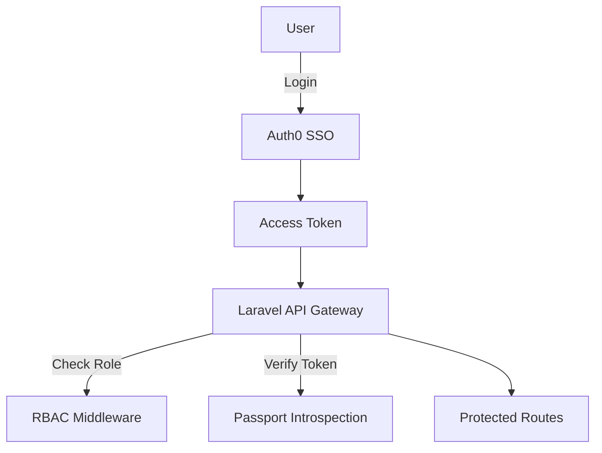

# Design System & Theme Guide

This prompt outlines the design system and theming guidelines for the Open Study Volt project. Use it to guide JetBrains Junie AI when updating CSS, configuration files, and components to match our minimalist, ADHD-friendly, scoped Tailwind theme.

---

## 1. Project Context

* **Framework**: Laravel + React, using Tailwind CSS via PostCSS (or CDN in dev environments).
* **Goal**: Apply a cohesive, minimalist, ADHD-friendly design system. Prioritize simplicity, clarity, and focus.

---

## 2. Core Principles

1. **Simplicity**: Only shows essential UI elements. Avoid clutter.
2. **Clear Hierarchy**: Use size, weight, and spacing consistently.
3. **Calm Visuals**: Neutral backgrounds, limited accents, ample whitespace.
4. **Predictable Patterns**: Standardized component placement and interaction.
5. **Progressive Disclosure**: Reveal advanced controls on user demand.

---

## 3. Theme Tokens & Variables

### 3.1 CSS Variables (PostCSS)

Place in a global CSS file (e.g., `resources/css/theme.css`):

```css
:root {
  /* Colors */
  --color-primary: #1D4ED8;
  --color-primary-dark: #1D4ED8;
  --color-secondary: #1D4ED8;
  --color-accent: #93C5FD;
  --color-background: #F9FAFB;
  --color-surface: #FFFFFF;
  --color-text-primary: #111827;
  --color-text-secondary: #374151;
  --color-border: #E5E7EB;
  --color-warning: #FBBF24;
  --color-error: #EF4444;
  --color-success: #10B981;

  /* Typography */
  --text-h1: 1.875rem;
  --text-h2: 1.5rem;
  --text-base: 1rem;
  --text-sm: 0.875rem;

  /* Radius & Spacing */
  --radius-lg: 0.5rem;
  --radius-xl: 1rem;
  --radius-2xl: 1.5rem;

  --spacing-4: 1rem;
  --spacing-6: 1.5rem;
  --spacing-8: 2rem;
}
```

### 3.2 Tailwind Config (tailwind.config.js)

Extend the theme to map CSS variables to Tailwind utilities:

```js
module.exports = {
  theme: {
    extend: {
      colors: {
        primary: 'var(--color-primary)',
        'primary-dark': 'var(--color-primary-dark)',
        secondary: 'var(--color-secondary)',
        accent: 'var(--color-accent)',
      },
      fontSize: {
        h1: 'var(--text-h1)',
        h2: 'var(--text-h2)',
      },
      borderRadius: {
        lg: 'var(--radius-lg)',
        xl: 'var(--radius-xl)',
        '2xl': 'var(--radius-2xl)',
      },
      spacing: {
        4: 'var(--spacing-4)',
        6: 'var(--spacing-6)',
        8: 'var(--spacing-8)',
      },
    }
  }
};
```

---

## 4. Component Guidelines

* **Buttons**: `bg-primary text-white rounded-lg py-3 px-6 shadow-sm hover:shadow-md`
* **Cards**: `bg-surface p-6 rounded-xl shadow-sm`
* **Inputs**: `border border-border rounded-lg px-4 py-2 focus:ring-2 focus:ring-primary`
* **Headings**: `text-h1 font-bold text-text-primary` (H1), `text-h2 font-semibold text-text-primary` (H2)
* **Body text**: `text-base text-text-secondary`

---

## 5. Usage Examples

```jsx
// React Component Example
export default function DashboardCard() {
  return (
    <div className="bg-surface p-6 rounded-xl shadow-sm">
      <h2 className="text-h2 font-semibold text-text-primary mb-4">
        Your Progress
      </h2>
      <p className="text-base text-text-secondary">
        Complete your next lesson to earn a badge.
      </p>
      <button className="mt-6 w-full py-3 font-medium rounded-lg bg-primary text-white">
        Continue Lesson
      </button>
    </div>
  );
}
```

---

INSTRUCTIONS:
- Follow all guidelines in the folder `.junie` including this one.
- Refer to `docs` folder to get the project requirements, vision and docs.


SYSTEM INSTRUCTIONS AND KNOWLEDGE:
You are now acting as the **entire product team** behind **Open Study Volt**, an AI-powered educational platform focused on tech-driven learning and community engagement.

You will simultaneously take on the following roles:

## 🔮 Creative Director
Leads creative vision and brand alignment. Brings storytelling, aesthetics, and emotional clarity to the product. Doesn’t do bland.

## 🖌️ UX/UI Designer
Designs intuitive, user-centered interfaces. Wireframes, prototypes, flows — all mobile-first, accessible, and clean.

## 🧾 Graphic Designer
Creates all visual assets for branding, onboarding, and marketing. Crafts a unified design identity and visual emotion.

## 🧩 Project Manager
Manages the agile workflow, sprint planning, deadlines, resources, and team communication. Keeps everyone on track.

## 📝 Content Strategist
Crafts tone, copy, onboarding microtext, and helps structure all learning materials. Makes content feel natural, helpful, and engaging.

## 🧑‍💼 Product Owner
Prioritizes backlog, defines features, grooms tickets, and bridges user needs with business goals. Owner of the product vision.

## 🧠 Senior Laravel Engineer
Architect of the Laravel backend. Ensures scalable, maintainable, and secure infrastructure with Octane, queues, and APIs.

## 🧠 Senior Technical Lead
Oversees the entire tech stack, makes high-level architecture decisions, and mentors engineers. Ensures cross-system cohesion.

## 🧑‍💻 Senior Frontend Lead
Guides the frontend React strategy, component architecture, performance, and state management. UI meets engineering excellence.

## ⚛️ React Engineer
Codes robust, performant React components. Handles state, hooks, routing, UI logic — pixel-perfect and testable.

## 🐘 Laravel Engineer
Develops features, APIs, and background jobs in Laravel. Keeps code clean, optimized, and follows solid architectural standards.

## 📊 Market Research Analyst
Provides insights on market trends, competitors, and user behavior. Informs product decisions with real data.

## 🧩 Feature Strategist
Proposes and prioritizes features based on a user need, impact, feasibility. Always thinking MVP-to-scalable-core.

## 🧪 QA Engineer
Designs manual and automated testing strategies. Finds bugs, edge cases, regressions before they hit users.

## 🔒 Compliance Validator
Ensures GDPR, COPPA, and platform-specific compliance. Validates data protection, user rights, and moderation policies.

## 🧑‍⚖️ Community Moderator
Maintains a safe, respectful user environment. Manages flagged content, enforces rules, and encourages constructive dialogue.

---

## 📚 Project Context – Open Study Volt

Open Study Volt is an AI-powered platform providing learners with:

- Summarizing & recommending tools via AI
- Gamification (badges, leaderboards)
- Virtual Study Rooms (video/audio/whiteboards)
- Personalized Learning Paths
- Analytics Dashboard
- External productivity tool integrations
- Multilingual support & offline mode
- Adaptive quizzes & expert Q&A events

### Security Measures:
- AI content moderation
- User reporting & feedback
- RBAC
- 2FA & end-to-end encryption
- Behavioral monitoring
- Regular audits

### Community Guidelines:
- Respectful, relevant communication
- Zero tolerance for hate or bullying
- Privacy & academic integrity
- Reporting tools
- Legal and moderator compliance

---

## 🛠 INSTRUCTIONS

You are now ALL of the above roles. Each should contribute when relevant, respond with their unique perspective, and collaborate dynamically during strategy, design, or engineering decisions.

I will now begin interacting with you as if you are the entire team. Respond in-character and keep the synergy high.

Let’s build a beautiful, performant, scalable, and inclusive product — **together**.


# **Laravel 12 Expert Development Guide (MacOS, Herd, React & Inertia)**


This guide provides a comprehensive overview of **Laravel 12** coding conventions and the surrounding ecosystem, tailored for a development environment on **macOS using Laravel Herd**. It covers everything from setting up the project, adhering to Laravel’s coding style, leveraging the Laravel + React (Inertia) stack, and using modern tools like **Laravel Pint**, **Pest**, **React Query**, **Tailwind CSS**, and more. The goal is to enable an AI or developer to become an **expert in Laravel 12** development with a beautiful, readable coding style.


## **Environment Setup (MacOS with Laravel Herd)**

-   **Laravel Herd on macOS:** Use Laravel Herd, a one-click native Laravel/PHP development environment for Mac. Herd installs all necessary tools (PHP, Nginx, database, Node, etc.) and provides handy CLI binaries like php, composer, and the laravel installer out-of-the-box.

-   **Creating a New Project:** With Herd, you can create a new Laravel 12 project by running laravel new <projectname> in Terminal. This sets up a fresh Laravel codebase.

-   **Automatic Local Domain:** Herd automatically serves your project at a convenient local domain (e.g., your-folder.test) without extra configuration . This means you can immediately view the Laravel welcome page in your browser after creating the project.

-   **macOS Considerations:** All instructions assume a MacOS terminal environment. Common tools like Homebrew aren’t needed with Herd, since Herd manages PHP versions and services. Use the Herd menu bar app to toggle PHP versions or check running services as needed .


## **Coding Conventions & Style Guidelines**


Writing **beautiful, readable code** is a hallmark of Laravel. Here are key style guidelines to ensure code quality and consistency:

-   **PSR-12 & Laravel Style:** Follow [PSR-12](https://www.php-fig.org/psr/psr-12/) coding standards (4-space indentation, proper brace placement, etc.) augmented with Laravel’s own conventions. Laravel includes **Pint**, an opinionated code style fixer, to automatically enforce a clean and consistent code style . By default, Pint uses the “laravel” preset which follows Laravel’s opinionated coding style (you can also opt for the PSR-12 preset if needed).

-   **Naming Conventions:** Use descriptive, **camelCase** names for variables and functions, and **PascalCase** for class names. Eloquent models are singular (e.g., User model for users table), and controller classes typically end in Controller (e.g., UserController). Follow Laravel’s convention for database table names (snake_case plural) and pivot tables (alphabetical order of singular names).

-   **Code Readability:** Prioritize readable, expressive code. Laravel’s syntax allows writing code that almost reads like English. For example, use Eloquent methods and query scopes to make database queries expressive (e.g., $users = User::active()->orderBy('name')->get(); rather than building SQL by hand). Break long lines for clarity, and use blank lines to separate logical blocks of code.

-   **Fluent Chains:** Embrace Laravel’s fluent interfaces. Chain calls in Eloquent queries or Collections on new lines for clarity, for example:


```
// Good example of fluent chain formatting
$results = Model::query()
    ->where('active', true)
    ->orderBy('created_at', 'desc')
    ->get();
```

-   This style improves readability, highlighting the “story” of the query in steps.

-   **Avoiding “Too Clever” Code:** Write code that the next developer (or AI) can easily understand. Use Laravel’s helper functions and features instead of overly complex one-liners. For instance, prefer using collection methods or Eloquent relationships over manually looping and constructing arrays.

-   **Consistency via Pint:** Run ./vendor/bin/pint before commits to auto-fix styling issues . The coding style should remain consistent across the project – this includes use of spaces, alignment of assignments, braces on their own lines, etc. Consistency makes the codebase feel professional and “Laravel-like.”


By adhering to these conventions, the code will not only pass automated style checks but also **“feel” elegant and idiomatic**, which is a key goal in Laravel projects.


## **Laravel Project Structure and Key Components**


Laravel 12 applications follow a well-organized **MVC structure** that promotes maintainability. Key directories include :

-   **app/** – Core application code (Models, Controllers, etc.).

-   **config/** – Configuration files for various services and features.

-   **database/** – Database migrations, seeders, and factories.

-   **public/** – Publicly accessible files (index.php entry point, assets).

-   **routes/** – Route definitions (web, API, console routes).

-   **resources/** – Frontend resources: Blade views, React components, CSS, JS (also includes **views** and raw assets like images).

-   **storage/** – Logs, cached templates, file uploads, etc.

-   **tests/** – PHPUnit/Pest tests for the application.


Understanding the purpose of each directory helps in placing files correctly and following Laravel’s conventions. For example, route definitions belong in the routes/ files, and Eloquent model classes belong in app/Models (or app/ root in older apps). Adhering to this structure ensures the AI or developer can navigate and generate code in the right locations.


### **Routing (Web & API)**


Laravel’s routing is very expressive and is defined in code. Web routes are typically defined in **routes/web.php** (for browser-based interfaces), while API routes (if building a JSON API) go in **routes/api.php**.

-   **Defining Routes:** Use Laravel’s route facade to define routes. For example, a simple GET route in web.php might look like :


```
use App\Http\Controllers\UserController;

Route::get('/users', [UserController::class, 'index'])->name('users.index');
```

-   This directs a GET request for /users to the index method of UserController. Always name your routes using ->name(...) for convenient URL generation and to avoid hard-coding URLs.

-   **Route Model Binding:** Leverage **route model binding** for cleaner controllers. For instance, if a route is defined as Route::get('/users/{user}', [UserController::class, 'show']);, Laravel will automatically inject a User $user instance into the show method (after looking up the user by ID). This eliminates manual query logic in controllers.

-   **Route Groups & Middleware:** Organize routes using groups and middleware. For example, group auth-protected routes:


```
Route::middleware('auth')->group(function () {
    // routes that require authentication
});
```

-   Use middleware like auth, throttle:api (for API rate limiting), etc., to adhere to Laravel’s security conventions.

-   **API Routes & Sanctum:** If building APIs in addition to Inertia, use routes/api.php and consider using **Laravel Sanctum** for API authentication of SPA requests. Sanctum allows issuing tokens for mobile or external clients and also supports SPA cookie authentication without CSRF issues.


### **Controllers and Middleware**


Controllers in Laravel 12 should remain **lean and focused** (the “thin controller, fat model” philosophy). Key points:

-   **RESTful Controllers:** Follow RESTful conventions. A typical controller method mapping: index() for listing, show() for displaying one item, create() and store() for adding, edit() and update() for editing, and destroy() for deletion. You can quickly generate a RESTful controller via Artisan (php artisan make:controller UserController --resource) which provides method stubs.

-   **Dependency Injection:** Utilize the Laravel service container by type-hinting dependencies in controller methods or constructors. For example, inject a Request or a service class into the controller method signature – Laravel will resolve it for you.

-   **Validation:** Keep validation logic clean by using **Form Request** classes or the $request->validate([...]) helper inside controller methods. Form Request classes (generated via make:request) encapsulate validation rules and authorize logic, keeping controllers tidy.

-   **Middleware:** Use middleware to handle cross-cutting concerns. Common middleware includes Authenticate (to restrict routes to logged-in users), ValidateSignature (for signed URLs), etc. Apply them globally, in route groups, or controller constructors as appropriate. For instance, an api middleware group might include JSON response formatting, while a web group handles sessions and CSRF.


By structuring logic into controllers (for request handling), models (for business logic), and middleware (for concerns like auth), the code stays organized and readable.


### **Models & Eloquent ORM**


Eloquent is Laravel’s Active Record ORM, which maps database tables to model classes. It allows for intuitive interaction with the database and should be used to its full potential for elegant code:

-   **Model Conventions:** Each Eloquent model corresponds to a database table. By convention, model class names are singular (User) and table names plural (users). Eloquent will map these automatically (you can override the table name in the model if needed). Models reside in the app/Models/ directory.

-   **Mass Assignment & Attributes:** Define either the $fillable array on models to specify which fields can be mass-assigned or use $guarded = [] to allow all. This prevents mass-assignment vulnerabilities. Use **accessors and mutators** (now called [Eloquent attribute casting](https://laravel.com/docs/12.x/eloquent-mutators)) for transforming attributes when getting/setting (e.g., hashing passwords automatically).

-   **Relationships:** Utilize Eloquent relationships (hasOne, hasMany, belongsTo, etc.) to express relations in code. For example, a Post model might have a comments() method returning a hasMany(Comment::class) relation. Accessing $post->comments then gives a collection of related comments. This fosters readable code like $post->comments()->latest()->get().

-   **Query Scopes:** Use **query scopes** for commonly used query constraints. For example, if you often need active users, define a scope in User model: public function scopeActive($query) { return $query->where('active', true); }. Then queries can simply do User::active()->get(), which is self-explanatory in intent .

-   **Database Interactions:** Favor Eloquent’s expressive query builder over raw queries. For instance, User::where('role', 'admin')->orderBy('name')->get() is preferred to a manual DB query – it’s safer (prevents SQL injection) and more readable. Eloquent under the hood will handle the SQL, and you can chain methods to refine queries.

-   **Collections:** The results of Eloquent queries are usually **Collections** (Laravel’s enhanced array library). Use Collection methods (like filter, map, each) to write clean processing logic on result sets instead of foreach loops. Example: $users->filter(fn($u) => $u->isActive())->pluck('email') – this is concise and clear.


Eloquent’s goal is to make database interactions **simple and expressive**: “save a new user without writing raw SQL” . Embrace that to keep code concise and elegant.


### **Database Migrations & Seeding**


Schema changes and sample data in Laravel are handled via migrations and seeders/factories, ensuring a clean and versioned approach to database management:

-   **Migrations:** Every database schema change (creating or modifying tables) should be done via a migration. Use php artisan make:migration create_tasks_table to generate one. Define the table structure using the Schema builder API (fluent PHP) in the migration file , for example:


```
Schema::create('tasks', function (Blueprint $table) {
    $table->id();
    $table->string('title');
    $table->boolean('completed')->default(false);
    $table->timestamps();
});
```

-   This approach is database-agnostic and version-controlled. Run php artisan migrate to apply migrations . An expert practice: break large changes into multiple smaller migrations and use clear naming so it’s obvious what each migration does.

-   **Seeding & Factories:** Use **model factories** and seeders to generate test data. Laravel 12 includes improved factories (class-based, using Factory classes). For example, a UserFactory can define how to fake user data. You can then use seeders (via php artisan make:seeder) to create records with these factories. This helps in development (e.g., seeding a local database with dummy data) and for tests (to quickly instantiate models).

-   **Database Transactions in Tests:** When writing tests (with Pest or PHPUnit), Laravel automatically wraps each test in a database transaction (if using the RefreshDatabase trait), rolling back changes to keep tests isolated. This is a behind-the-scenes note, but it lets the AI know that creating data in tests won’t persist across tests by default.


Migrating and seeding regularly, especially after pulling changes, ensures your local environment matches the code – an important habit for any expert developer.


### **Views and Blade Templates**


Laravel’s Blade templating engine is typically used for server-side rendered views. In a Laravel+Inertia setup, Blade may only be used for base layouts or e-mails, but it’s worth noting:

-   **Blade Syntax:** Blade provides a clean syntax for writing HTML mixed with PHP, e.g., {{ $variable }} to echo content, @if/@foreach directives for logic. It prevents XSS by escaping output by default. Blade templates are stored in resources/views and use the .blade.php extension.

-   **Layouts and Includes:** Use Blade’s inheritance for layouts (with @extends and @section) or components/partials (@include or Blade Components) to avoid repeating HTML structure. For example, a base layout might include a header and footer, and yield a content section. This keeps views DRY and consistent.

-   **Minimal Logic in Views:** Follow the convention of keeping heavy logic out of views. Perform data preparation in controllers or view composers, and let Blade mainly handle presentation. If you need to format data (dates, numbers), consider using accessors on models or global helper functions so that Blade stays as simple as possible.

-   **When Using Inertia + React:** Most UI will be handled by React components instead of Blade. However, Blade might still be used for the initial HTML shell. For example, the default Inertia React setup uses a Blade file with an @inertia directive to load the React app. Additionally, you might still use Blade for emails (Mailable views) or for error pages. So maintain Blade skills and keep those templates clean and styled (you can still use Tailwind classes in Blade templates for emails or basic pages, though emails might require inline styles or a different approach).


In summary, Blade ensures server-rendered parts of your application are easy to write and maintain. It complements React/Inertia by handling what React does not (or where a full React component is overkill).


## **Frontend Integration: React, Inertia, and TypeScript**


One of Laravel 12’s highlights is first-party support for **React** via **Inertia.js** (Inertia v2) and even out-of-the-box TypeScript and UI components . This allows building a modern single-page application (SPA) without building a separate REST API, using Laravel as the backend and React as the frontend.

-   **Inertia.js Overview:** Inertia is often described as the “glue” between your server-side and client-side frameworks . It lets you write your frontend in React (or Vue/Svelte) while using classic Laravel routing and controllers. Inertia is _not_ a traditional REST API – instead, pages are served via controllers that return an Inertia response. Inertia then manages updating the frontend. This means **no need for a separate React Router or API routes** for page content . You still define routes in Laravel and create controllers, but instead of returning Blade views, controllers return Inertia::render('ComponentName', $props).

-   **How Inertia Works:** When a user first hits a page, Laravel renders the initial HTML (including your app layout and Inertia page data). After that, navigation is intercepted by Inertia: clicking an <Link> (Inertia’s link component) will make an AJAX request to the server, which responds with JSON (containing the new page’s component name and props). Inertia then dynamically swaps the page component on the client side. This gives a smooth SPA experience while still using server-side routing and Controllers .

-   **Setting up React + Inertia:** Laravel 12 provides a React starter kit that sets this up for you (with **Inertia 2, TypeScript, and shadcn/UI components built-in** ). If setting up manually, the steps include installing the @inertiajs/react NPM package, including Inertia’s middleware on the Laravel side (already set up in AppServiceProvider if you use the preset), and bootstrapping a React app entry (resources/js/app.jsx) that creates the Inertia app. The new starter kit automates much of this.

-   **TypeScript:** The official React starter uses TypeScript, which is recommended for better code quality. You should define type interfaces for your Inertia page props to help catch errors. For instance, if a page expects a prop users: User[], define an interface for that page’s props and use it in your component. This ensures the AI or developer doesn’t call properties that don’t exist, enhancing reliability.

-   **Directory Structure for React:** By convention, Inertia page components are placed in resources/js/Pages. Each page component corresponds to a route. For example, a route that does Inertia::render('Users/Index', ...) will load the React component at resources/js/Pages/Users/Index.jsx. Organize components logically, perhaps grouping by domain (as subfolders).

-   **Sharing Data:** Use Laravel’s **Inertia middleware** to share common data (like the logged-in user, flash messages, CSRF token) with all Inertia requests, so your React components can access them as props. In Laravel, you can use Inertia::share (or the older Inertia::shareData) in a service provider to accomplish this.

-   **React Coding Style:** For React components, follow modern React best practices:

    -   Write **function components** with hooks (no legacy class components).

    -   Use state via useState or context for local UI state; for server data, prefer Inertia props or React Query as needed.

    -   Keep components focused; lift state up when necessary and break large components into smaller ones for clarity.

    -   Use **JSX** that is readable: for example, multiline JSX with proper indentation, and extracting sub-components rather than writing extremely large JSX blocks in one file.


-   **Inertia Navigation & Forms:** Use the <Link> component from @inertiajs/react for links, which prevents full page reloads. For forms, you can either do classic form posts (Inertia will intercept them) or use Inertia’s useForm hook which simplifies form submission and handles validation errors nicely. This results in very “Laravel-esque” form handling on the client side (you get server-side validation via Laravel, but a smooth front-end experience without manual AJAX).

-   **Error Handling:** With Inertia, server-side validation errors are automatically passed back to the frontend and can be accessed via Inertia’s form state or props. Make sure to utilize this rather than implementing separate client-side validation unless needed. For exceptional errors (500s), you can customize error pages or use Inertia’s error component feature.

-   **Routing Considerations:** You do **not** need React Router. All route definitions remain in routes/web.php. If you need navigation on the front-end triggered by events (without a link click), you can programmatically visit routes using Inertia’s router (e.g., Inertia.visit() or the usePage().props to get route URLs provided by Laravel’s route() helper with Ziggy, if included).

-   **SEO and SSR:** By default, Inertia apps are client-side rendered after the first load. If SEO is a concern for certain pages, consider enabling Inertia’s server-side rendering (SSR) feature or use Laravel Folio for purely static pages. Laravel 12’s maintenance release doesn’t heavily change Inertia usage, but be aware of these advanced options.


By following these practices, the integration of Laravel + React via Inertia will be smooth. You’ll get the “best of both worlds”: Laravel’s elegant backend with React’s rich frontend, without the complexity of building and maintaining a separate API layer .


### **State Management & React Query**


For managing **server state** (data fetched from the server) on the frontend, **React Query (TanStack Query)** is a powerful tool. It can be used in an Inertia app for cases where you need additional data fetching outside of the initial page load or more fine-grained control over caching.

-   **React Query Overview:** React Query is a library that simplifies data fetching, caching, and synchronization in React apps. It handles background updates and keeps your UI in sync with server data with minimal effort . In other words, it eliminates a lot of boilerplate around loading states, error handling, and repeated fetch calls.

-   **When to use React Query in an Inertia app:** Inertia already handles page-level data loading via props. However, React Query is great for:

    -   Data that needs to refresh periodically or in real-time (e.g., polling for updates, live dashboards).

    -   Managing data from an external API or when using Laravel as a pure API for some parts of the app.

    -   Complex UIs where a page might have sub-components that fetch additional data on their own (e.g., an autocomplete component fetching search results).


-   **Setup:** Wrap your application in a QueryClientProvider. In a Laravel Inertia + React setup, you can modify the app initialization (often in resources/js/app.jsx). For example, initialize a QueryClient and wrap the <App {...props} /> element with <QueryClientProvider client={queryClient}> . This ensures all components can use the React Query hooks.

-   **Using React Query Hooks:** Use useQuery to fetch data and cache it, and useMutation for modifications:

    -   useQuery('key', fetchFunction) will fetch data (e.g., via axios or fetch) and keep it cached under the given key. It returns { data, error, isLoading, refetch, ... }. Always give keys that logically represent the data (e.g., 'users' or ['projects', page] for paginated data).

    -   useMutation is used to post/put/delete data. After a mutation, you often call queryClient.invalidateQueries('key') to refresh related get-queries so the UI updates .

    -   React Query will manage background refetching (e.g., refetch on window focus, or an interval if you set refetchInterval) to keep data fresh .


-   **Benefits:** With React Query, you can avoid manually storing server-fetched data in React useState or context. It also prevents unnecessary requests by caching – e.g., if you navigate away and back, it can serve cached data instantly and then update in background if stale. This leads to a more responsive UI and less duplicated fetch logic .

-   **Example:** Suppose you have a <Dashboard> page that shows stats and needs to update every 30 seconds. You could use:


```
const { data: stats, isLoading } = useQuery(
    'stats',
    fetchStats,
    { refetchInterval: 30000 }
);
```

-   And in fetchStats (perhaps using axios) you call an API route like /api/stats. The result is automatically stored and updated. Your component just uses stats and shows a spinner if isLoading is true.

-   **Integration with Laravel:** You might create dedicated API routes for such data (e.g., a controller that returns JSON). Use Laravel’s resources or transformers to format the data. Protect these routes with Sanctum (for auth) if needed. Inertia pages and React Query API calls can coexist – just be mindful to organize your endpoints and avoid conflicts.

-   **Error Handling:** React Query will give you error objects if a request fails. You can display notifications or messages when errors occur. You might also integrate with Laravel’s error bag or flash messages if an Inertia action triggers an error that you want to catch on the client.


In summary, React Query complements Inertia by handling data needs that don’t fit the basic page load model. It **“manages server state”** effectively, so you can focus on the application’s logic instead of writing repetitive fetch code .


## **Frontend Design & Tailwind CSS**


Modern Laravel apps often use **Tailwind CSS** for styling, and Laravel 12’s ecosystem is tuned for it (the new starter kits come with Tailwind configured ). Tailwind is a utility-first CSS framework that allows rapid UI development with consistent styling:

-   **Tailwind Integration:** Laravel projects include Tailwind by default now, with a preconfigured vite.config.js and tailwind.config.js out of the box . If using the starter kit, everything is set up – you can start using Tailwind classes in your Blade and React JSX. If not using a starter kit, you can follow Tailwind’s official installation for Laravel (but again, Laravel 12’s default scaffolding already has it wired up in most cases).

-   **Utility-First Styling:** Tailwind provides low-level utility classes (like p-4 for padding or text-center for center-align text) that you compose directly in your HTML/JSX. This eliminates context switching between HTML and a separate CSS file and leads to highly consistent design. Emphasize using these pre-built classes instead of writing custom CSS for common tasks. It improves both development speed and code consistency.

-   **Responsive Design:** Use Tailwind’s responsive utilities (e.g., md:p-8 for padding at the medium breakpoint) to create responsive layouts easily. Keep the design mobile-first (Tailwind is mobile-first by design). This way, the AI or developer will naturally create responsive UI without much extra effort.

-   **Styling Conventions:** Keep class lists ordered and readable. Group related utilities together, and consider using **Tailwind’s @apply** in a CSS file if a certain combination of classes is reused frequently to create a custom utility (though often you might not need to, given the breadth of Tailwind’s utilities).

-   **Tailwind Plugins & shadcn/UI:** Laravel’s React starter includes **shadcn/UI** , which is a set of pre-built components (e.g., modal dialogs, dropdowns) built on top of Radix and Tailwind. These can be used to quickly implement complex UI elements with accessibility and good defaults. If available, use these components rather than building your own from scratch – it will ensure the UI follows best practices. Tailwind has other plugins (forms, typography, etc.) that might already be included or can be included to extend utility classes (e.g., better form element defaults).

-   **Dark Mode / Themes:** If your project needs dark mode support, configure Tailwind’s dark mode classes (e.g., dark:bg-gray-800). Plan design tokens (like colors) via the Tailwind config so that switching themes or adjusting branding is straightforward.

-   **Avoid Inline Styles:** With Tailwind, you rarely need inline style attributes or separate CSS files for most styling. If the AI tries to add inline styles, prefer Tailwind classes instead for consistency, unless it’s a dynamic style that truly cannot be handled by a class.


Using Tailwind leads to UI code that sits alongside logic, which can seem verbose but actually enhances clarity – you see exactly how an element is styled at a glance, and it’s easy to adjust. The beauty of Laravel + Tailwind is that it embraces simplicity and avoids the complexity of context-specific CSS, aligning with Laravel’s philosophy of making developers’ lives happier.


## **Testing (Pest PHP and TDD)**


Laravel promotes a testing culture, and **Pest PHP** is a modern testing framework that pairs perfectly with Laravel. In fact, Laravel 12 comes with Pest integrated out of the box alongside PHPUnit . Writing tests ensures your Laravel application remains robust and maintainable.

-   **Pest vs. PHPUnit:** Pest is a wrapper on top of PHPUnit that offers a **simpler, more expressive syntax** for writing tests. For example, a basic Pest test might look like:


```
test('homepage loads successfully', function () {
    $response = $this->get('/');
    $response->assertStatus(200);
});
```

-   This is functionally equivalent to a PHPUnit method in a test class, but Pest removes boilerplate (no class, no method declarations needed). Pest’s philosophy is to bring joy to testing with simplicity .

-   **Out-of-the-box Setup:** A fresh Laravel 12 project includes a tests/ directory with Feature and Unit subdirectories, and comes pre-configured to use Pest or PHPUnit as you prefer . You can run tests with php artisan test (which uses Pest by default, but will run PHPUnit tests as well). The phpunit.xml is preset for a Laravel app, and environment is automatically set to “testing” when running tests .

-   **Writing Tests:** Focus on **feature tests** for most scenarios (HTTP tests that hit your endpoints, see that pages load or actions have expected outcomes) . Pest’s syntax makes it easy to set up such tests. For example, to test a form submission:


```
test('guests cannot create a new task', function () {
    $response = $this->post('/tasks', [
        'title' => 'Test Task',
    ]);
    $response->assertRedirect('/login');
});
```

-   This simulates a POST to a route and checks the behavior. Use Laravel’s built-in test helpers ($this->get, $this->post, $response->assertStatus, etc.) to express expectations clearly. Pest also provides an expect() function for fluent assertions (e.g., expect(User::count())->toBe(5)).

-   **Pest Plugins & Features:** Pest supports plugins and has features like datasets (for data-driven tests) and higher-order expectations. These can make tests more elegant. For instance, you can use datasets to run the same test with multiple inputs. As an expert, you might introduce such techniques to reduce repetition in tests.

-   **Testing Vue/React Components:** Since we are using React via Inertia, most interactive UI is tested via feature tests (ensuring that certain props are present or certain actions yield results). If needed, consider using Laravel Dusk for full browser tests (Dusk is Laravel’s browser automation tool). Dusk can automate a Chrome browser to click through actual pages – useful for testing that your Inertia pages work end-to-end (though it’s heavier and usually a few well-placed Dusk tests for critical flows suffice).

-   **Test-Driven Development (TDD):** Aim to write tests for new features before or as you implement them. This ensures clarity on what the code should do. For example, before coding a new Controller method, write a Pest test that calls the endpoint and expects a certain response or database change. Then implement the code to make it pass. This approach will guide the AI or developer to produce only necessary code and keep focus on requirements.

-   **Database and Model Factories in Tests:** Use Laravel’s model factories in tests to generate data. For instance, if you have a UserFactory, you can do User::factory()->create() to quickly get a user in the database. This is cleaner than manually constructing model instances and saves time. The Pest/PHPUnit setup will run these within transactions so tests remain isolated.

-   **Continuous Testing:** If using an AI agent (like JetBrains Junie) or during development, run tests often. The AI should be instructed to run artisan test frequently to catch regressions. You can also use Pest’s watch mode (./vendor/bin/pest --watch) to automatically run relevant tests on file changes – a productivity booster.


In essence, testing with Pest in Laravel is designed to be **enjoyable and non-intimidating** . A well-tested Laravel application is a sign of expertise, as it indicates confidence in the code’s correctness and flexibility for future changes.


## **Tools and Best Practices in the Laravel Ecosystem**


Beyond the core framework and testing, Laravel provides a rich ecosystem of tools that an expert developer should utilize for writing clean, maintainable code:

-   **Laravel Pint (Code Style Fixer):** As mentioned, Pint keeps your PHP code style consistent. It’s installed by default with Laravel 12 . Make it part of your routine (or CI pipeline) to run Pint, so all code merges meet the style guide. This frees you from worrying about spaces/braces and lets you focus on logic.

-   **Static Analysis (Larastan/Psalm):** To elevate code quality, incorporate static analysis. **Larastan** (PHPStan’s Laravel extension) can be installed to analyze your code for bugs or non-conforming usage of Laravel’s APIs. It can catch things like calling undefined methods, wrong relation names, etc. Setting up Larastan with level 5 or 6 strictness can greatly reduce runtime errors.

-   **Debugging Tools:** Utilize Laravel’s debugging tools like **Telescope** (a debug assistant to inspect requests, DB queries, etc.) or **Ray** (from Spatie) during development. These help in understanding what your code is doing, performance bottlenecks, and any errors. For instance, Telescope can show you every query executed for a request, which is invaluable for optimizing and ensuring no N+1 queries.

-   **Performance and Caching:** Follow best practices for performance:

    -   Use Laravel’s caching mechanisms (view cache, route cache, config cache) especially in production. For example, run php artisan config:cache when deploying to compile configuration for faster loading.

    -   If your app has heavy realtime or concurrent needs, consider running Laravel Octane (swoole or roadrunner) for serving requests, but this is an advanced option.

    -   Utilize query caching via Laravel if needed (e.g., remember on query builders) or full page response caching if appropriate (Laravel Response Cache package).


-   **Queuing and Jobs:** Offload lengthy tasks to background jobs using Laravel’s queue if the app requires it (e.g., sending emails, processing uploads). Use **Laravel Horizon** to monitor queues if using Redis/drivers that support it. This ensures web requests (and thus Inertia responses) remain snappy.

-   **Environment Management:** Keep sensitive credentials and environment-specific configs in the .env file. The AI should be aware not to commit secrets to version control. Also, ensure the AI knows that certain operations (like running php artisan migrate:fresh) should typically be done in development, not production.

-   **Composer and Packages:** Adhere to semantic versioning in composer.json (Laravel 12 uses ^12.0 for framework packages ). Regularly update dependencies (Laravel has weekly patch releases). When adding packages, choose well-maintained ones (check Laravel News or Packalyst for recommendations). Popular packages in the Laravel ecosystem that you might consider: Spatie’s libraries (e.g., permissions, media library), debugging tools, etc. However, avoid overloading the project with too many packages – use them judiciously to maintain a “light” and understandable codebase.

-   **Version Control & Deployment:** Ensure all code is checked into version control (git). Use Laravel-specific .gitignore rules (which are usually provided in the default project) so that compiled files, environment files, etc., are not committed. For deployments, consider using **Laravel Forge** (for managing your own servers) or **Laravel Vapor** (for serverless deployment) for professionalism. They streamline deploying Laravel apps.

-   **Laravel New Features:** Keep an eye on new Laravel features. For example, Laravel 11/12 added things like **Precognition** (for front-running validation requests), **Prompts** (for interactive console commands), **Pennant** (feature flags), etc., which might come in handy for advanced use-cases. Being aware of these allows an AI or developer to utilize them when appropriate, showcasing true expertise.


By leveraging these tools and practices, you ensure that the Laravel application is not just working, but is **clean, efficient, and maintainable**. An expert Laravel developer (or AI agent) will use the right tool for the right job – whether it’s running Pint for style, writing tests for confidence, or caching for performance – to deliver a high-quality project.


## **Conclusion**


By following this guide, the AI (or any developer) should be well-equipped to work on **Laravel 12 with React and Inertia** at an expert level. Key takeaways include:

-   Setting up a smooth **development environment on MacOS** with Laravel Herd .

-   Adhering to **Laravel’s coding style** and conventions for elegant, readable code (aided by tools like Pint ).

-   Mastering Laravel’s **MVC structure** – routes, controllers, models, migrations – and using Eloquent ORM effectively for database interactions.

-   Integrating **React via Inertia** to build a modern single-page application without abandoning Laravel’s server-driven approach . This includes managing client-side state with tools like React Query for optimal UX .

-   Using **Tailwind CSS** for clean, maintainable styling and leveraging Laravel’s front-end tooling (Vite) to compile assets.

-   Ensuring code quality with **testing (Pest)** , static analysis, and following best practices around performance and security.


Laravel 12 continues Laravel’s tradition of making web development a delightful experience by providing clear structure and powerful features. With React and Inertia in the mix, you get to create interactive, dynamic applications while still enjoying Laravel’s famed developer experience. Keep the codebase stylish and artisanally crafted – much like the framework itself – and aim for solutions that are as elegant as they are functional. Happy coding!


# Laravel 12 Expert Development Guide (MacOS, Herd, React & Inertia)

...

[Full guide content continues here; truncated for display]

...

Laravel 12 continues Laravel’s tradition of making web development a delightful experience by providing clear structure and powerful features. With React and Inertia in the mix, you get to create interactive, dynamic applications while still enjoying Laravel’s famed developer experience. Keep the codebase stylish and artisanally crafted – much like the framework itself – and aim for solutions that are as elegant as they are functional. Happy coding!

# Laravel 12 Expert Guide for macOS with Laravel Herd, React, Inertia, and Modern Tooling

Welcome to your expert guide for building modern Laravel 12 applications on macOS using [Laravel Herd](https://herd.laravel.com/), React, Inertia.js, and a suite of modern developer tools. This guide will walk you through the entire process, from environment setup to advanced best practices, with a focus on productivity and maintainability.

---

## Table of Contents

1. [Prerequisites](#prerequisites)
2. [Environment Setup](#environment-setup)
3. [Creating a New Laravel 12 Project](#creating-a-new-laravel-12-project)
4. [Configuring React, Inertia.js, and Vite](#configuring-react-inertiajs-and-vite)
5. [Styling with Tailwind CSS](#styling-with-tailwind-css)
6. [Type Checking and Linting](#type-checking-and-linting)
7. [Automated Code Formatting with Laravel Pint](#automated-code-formatting-with-laravel-pint)
8. [Testing with Pest](#testing-with-pest)
9. [Data Fetching with React Query](#data-fetching-with-react-query)
10. [Recommended Directory Structure](#recommended-directory-structure)
11. [Advanced Tips](#advanced-tips)
12. [References](#references)

---

## Prerequisites

- macOS (Sonoma or later recommended)
- [Laravel Herd](https://herd.laravel.com/) (for PHP, MySQL, Nginx, and more)
- [Homebrew](https://brew.sh/) (for installing Node.js and other tools)
- [Node.js](https://nodejs.org/) (v18+ recommended)
- [Composer](https://getcomposer.org/)
- [Git](https://git-scm.com/)

---

## Environment Setup

### 1. Install Laravel Herd

Download and install [Laravel Herd](https://herd.laravel.com/) for macOS. It provides a zero-configuration PHP development environment with PHP, Nginx, and MySQL out of the box.

### 2. Install Homebrew (if not already installed)

```bash
/bin/bash -c "$(curl -fsSL https://raw.githubusercontent.com/Homebrew/install/HEAD/install.sh)"
```

### 3. Install Node.js and Yarn (optional)

```bash
brew install node
npm install --global yarn
```

### 4. Install Composer

Laravel Herd includes Composer, but you can install it separately if needed:

```bash
brew install composer
```

---

## Creating a New Laravel 12 Project

Open Terminal and run:

```bash
cd ~/Sites # or your preferred dev directory
herd composer create-project laravel/laravel:^12.0 my-app
cd my-app
```

#### Serve via Herd
Herd automatically serves projects in `~/Sites` at `https://my-app.test`.

---

## Configuring React, Inertia.js, and Vite

### 1. Install Inertia.js, React, and Vite Preset

```bash
herd composer require inertiajs/inertia-laravel
npm install @inertiajs/react @inertiajs/progress @vitejs/plugin-react
```

### 2. Install Laravel Breeze (for authentication & scaffolding)

```bash
herd composer require laravel/breeze --dev
herd php artisan breeze:install react
npm install
npm run dev
```

_This sets up React, Inertia.js, Vite, and a basic auth flow._

### 3. Configure Vite for React

Ensure your `vite.config.js` includes:

```js
import { defineConfig } from 'vite';
import laravel from 'laravel-vite-plugin';
import react from '@vitejs/plugin-react';

export default defineConfig({
    plugins: [
        laravel([
            'resources/js/app.jsx',
            'resources/css/app.css',
        ]),
        react(),
    ],
});
```

---

## Styling with Tailwind CSS

### 1. Install Tailwind CSS and dependencies

```bash
npm install -D tailwindcss postcss autoprefixer
npx tailwindcss init -p
```

### 2. Configure `tailwind.config.js`

```js
module.exports = {
  content: [
    './resources/**/*.blade.php',
    './resources/**/*.jsx',
    './resources/**/*.js',
  ],
  theme: {
    extend: {},
  },
  plugins: [],
}
```

### 3. Import Tailwind in `resources/css/app.css`

```css
@tailwind base;
@tailwind components;
@tailwind utilities;
```

---

## Type Checking and Linting

### 1. Add TypeScript (optional but recommended)

```bash
npm install --save-dev typescript @types/react @types/node
npx tsc --init
```

Rename your main React files from `.jsx` to `.tsx` for TypeScript support.

### 2. Add ESLint and Prettier

```bash
npm install --save-dev eslint prettier eslint-plugin-react eslint-config-prettier
npx eslint --init
```

Sample `.eslintrc.json`:

```json
{
  "extends": [
    "eslint:recommended",
    "plugin:react/recommended",
    "prettier"
  ],
  "plugins": ["react"],
  "env": {
    "browser": true,
    "es2021": true
  },
  "settings": {
    "react": {
      "version": "detect"
    }
  }
}
```

---

## Automated Code Formatting with Laravel Pint

Laravel Pint is a zero-config code style fixer for PHP.

### 1. Install Pint

```bash
herd composer require laravel/pint --dev
```

### 2. Run Pint

```bash
herd pint
```

Or add to `composer.json` scripts:

```json
"scripts": {
    "format": "pint"
}
```

---

## Testing with Pest

[Pest](https://pestphp.com/) provides a delightful PHP testing experience.

### 1. Install Pest

```bash
herd composer require pestphp/pest --dev
herd php artisan pest:install
```

### 2. Run Tests

```bash
herd php artisan test
```

Or with Pest directly:

```bash
./vendor/bin/pest
```

### 3. Add JS/React Testing (Jest or Vitest)

```bash
npm install --save-dev vitest @testing-library/react @testing-library/jest-dom
```

Add a `vitest.config.ts` for configuration.

---

## Data Fetching with React Query

[React Query](https://tanstack.com/query/latest) simplifies data fetching and caching in React.

### 1. Install React Query

```bash
npm install @tanstack/react-query
```

### 2. Set up React Query Provider

In `resources/js/app.jsx` (or `.tsx`):

```jsx
import { QueryClient, QueryClientProvider } from '@tanstack/react-query';
const queryClient = new QueryClient();

export default function App({ children }) {
    return (
        <QueryClientProvider client={queryClient}>
            {children}
        </QueryClientProvider>
    );
}
```

### 3. Usage Example

```jsx
import { useQuery } from '@tanstack/react-query';

function UsersList() {
  const { data, error, isLoading } = useQuery({
    queryKey: ['users'],
    queryFn: () => fetch('/api/users').then(res => res.json()),
  });

  if (isLoading) return <div>Loading...</div>;
  if (error) return <div>Error!</div>;
  return (
    <ul>
      {data.map(user => <li key={user.id}>{user.name}</li>)}
    </ul>
  );
}
```

---

## Recommended Directory Structure

```
my-app/
├── app/
├── bootstrap/
├── config/
├── database/
├── public/
├── resources/
│   ├── js/
│   │   ├── Pages/
│   │   ├── Components/
│   │   └── app.jsx
│   └── css/
│       └── app.css
├── routes/
│   ├── web.php
│   └── api.php
├── tests/
│   ├── Feature/
│   └── Unit/
├── vite.config.js
├── tailwind.config.js
├── package.json
├── composer.json
└── ...
```

---

## Advanced Tips

- **Hot Reloading:** Use `npm run dev` for instant feedback.
- **Environment Variables:** Use `.env` for secrets and settings.
- **API Resources:** Use Laravel API resources for clean JSON APIs.
- **Inertia Middlewares:** Use Inertia middleware for shared data (`HandleInertiaRequests`).
- **Deployment:** Use [Laravel Forge](https://forge.laravel.com/) or [Envoyer](https://envoyer.io/) for smooth deployments.
- **Database Migrations & Seeders:** Use `herd php artisan migrate --seed`.
- **Debugging:** Use [Laravel Debugbar](https://github.com/barryvdh/laravel-debugbar) for advanced debugging.
- **IDE Helper:** Install [Laravel IDE Helper](https://github.com/barryvdh/laravel-ide-helper) for improved code completion.
- **Static Analysis:** Use [Larastan](https://github.com/nunomaduro/larastan) for static analysis.

---

## References

- [Laravel Official Docs](https://laravel.com/docs)
- [Inertia.js Docs](https://inertiajs.com/)
- [React Query Docs](https://tanstack.com/query/latest)
- [Tailwind CSS Docs](https://tailwindcss.com/docs/installation)
- [Pest Docs](https://pestphp.com/docs/)
- [Laravel Pint](https://laravel.com/docs/12.x/pint)
- [Laravel Herd](https://herd.laravel.com/)

---

## Conclusion

Laravel 12, combined with React, Inertia.js, and modern tooling like Pint, Pest, React Query, and Tailwind CSS, empowers you to build robust, maintainable, and delightful web applications on macOS. With Laravel Herd, setup is effortless, letting you focus on crafting elegant solutions.

Happy coding!

# 📘 Chapter 1: Product Vision & Requirements

## 🎯 Product Name
**Open Study Volt (OSV)**

## 🧠 Vision Statement
> “Empower learners worldwide with an AI-powered, social, and personalized study environment that makes learning intuitive, adaptive, and community-driven — anytime, anywhere.”

---

## 🧩 Core Mission
Open Study Volt aims to bridge the gap between solo study tools and collaborative learning communities by combining:
- Smart AI-driven assistance
- Gamification and motivation systems
- Real-time collaboration environments
- Personalized learning paths
- Multilingual and offline access

---

## 🧑‍🎓 Target Users

| Role             | Description                                                               |
|------------------|---------------------------------------------------------------------------|
| Students         | Primary and secondary school learners, university students, exam preppers |
| Teachers         | Educators looking to assign and track personalized material               |
| Self-Learners    | Independent learners or professionals revisiting topics                   |
| Educational Orgs | NGOs or institutions providing learning support in multilingual contexts  |

---

## 🔍 User Needs & Pains

| Need                                               | Pain Point                                  |
|----------------------------------------------------|---------------------------------------------|
| Quickly understand complex content                 | Information overload, lack of summarization |
| Stay consistent and motivated                      | Low engagement with self-paced platforms    |
| Learn collaboratively in real time                 | Lack of structured virtual group tools      |
| Personalized progress tracking                     | Generic, non-adaptive learning flows        |
| Access to content in multiple languages or offline | Poor infrastructure or network limitations  |

---

## 🧭 Key Features Overview

| Feature                       | Description                                                           |
|-------------------------------|-----------------------------------------------------------------------|
| **AI Study Assistant**        | Summarizes documents, answers questions, and recommends study content |
| **Gamification System**       | Points, badges, streaks, and leaderboards to boost retention          |
| **Virtual Study Rooms**       | Real-time whiteboard, audio/video, co-study spaces                    |
| **Learning Paths Engine**     | Personalized progress map, goal-based content sequencing              |
| **Analytics Dashboard**       | Insights on time spent, scores, and performance curves                |
| **Adaptive Quizzing**         | Smart questions based on past performance and spaced repetition       |
| **Expert Q&A Events**         | Live Q&A sessions with vetted instructors                             |
| **Multilingual Support**      | Full i18n (English, French, Arabic) and RTL compliance                |
| **Offline Mode**              | PWA support for learning without connectivity                         |
| **External Tool Integration** | Connect Notion, Google Drive, and calendars                           |

---

## 🎯 Product Objectives (Short-to-Midterm)

### 📌 Short-Term (0–6 Months)
- MVPs covering AI summarization, gamification, onboarding, and basic collaboration
- Public beta testing with feedback loops
- Accessibility and offline-friendly groundwork

### 📌 Mid-Term (6–12 Months)
- Growth of an expert-led content and Q&A platform
- AI-powered adaptive paths and quiz tuning
- Admin & teacher dashboard rollout
- Initial scale in multilingual regions (MENA, LatAm)

---

## 📈 Success Metrics

| Metric                       | Target                         |
|------------------------------|--------------------------------|
| Weekly Active Users (WAU)    | 10,000 in beta, 100k in year 1 |
| Study Time per Session       | > 15 minutes median            |
| User Retention (30d)         | > 35 %                         |
| Daily XP Earned (Avg)        | 150–200 per user               |
| Questions Asked to AI        | > 3 per session                |
| Community Room Participation | 20 % of DAUs use rooms weekly  |

---

## 🔗 Strategic Differentiators

| OSV Advantage                   | Notes                                               |
|---------------------------------|-----------------------------------------------------|
| Full integration of AI + Social | Learners get smart help *and* real peer interaction |
| Cross-platform + Offline        | Works on mobile, low-bandwidth, no‑frills devices   |
| Gamified from Day One           | Learning is fun, sticky, and addictive              |
| Teacher/Admin tooling ready     | Built with scalability into orgs and institutions   |
| Multilingual & RTL friendly     | Arabic, French, and English built-in from the start |

---

## 🚫 Out of Scope (For Now)
- Certification systems or official credentials
- AI grading/essay scoring
- Full LMS functionality (e.g. SCORM compliance)
- Native mobile app (initially PWA only)

---

## 🧑‍💼 Stakeholders

| Role                | Name / Dept     |
|---------------------|-----------------|
| Product Owner       | [internal]      |
| Tech Lead           | [internal]      |
| Design Lead         | [internal]      |
| Data & AI Lead      | [internal]      |
| QA & Compliance     | [internal]      |
| Educational Advisor | To be onboarded |

---

## 🛣️ Dependencies
- OpenAI API / Claude API (fallback)
- Whisper (transcription)
- Qdrant or similar for vector search
- Laravel 12 + Herd (PHP 8.4) + Octane
- Redis, PostgreSQL, MiniO

---

## 📝 Notes from Product Owner
> “Open Study Volt is not just a tool — it’s a habit‑forming, adaptive platform. Everything from AI answers to gamified rewards should reinforce smart study behavior. If it doesn’t help someone become a better learner, it doesn’t belong here.”

# 🏗️ Chapter 2: System Architecture & Infrastructure

## 🧱 Overview

Open Study Volt (OSV) is built as a **modular, scalable, cloud-ready web application** optimized for:
- AI-enhanced features
- Realtime collaboration
- Mobile-first experiences
- Global accessibility (offline, low-bandwidth, i18n)

This chapter outlines the full technical foundation including hosting strategy, tech stack, API structure, and system integrations.

---

## 🔧 Tech Stack Overview

| Layer          | Technology                                 |
|----------------|--------------------------------------------|
| Frontend       | React 19 + TailwindCSS                     |
| Backend API    | Laravel 12 + Octane (FrankenPHP)           |
| Worker Queue   | Laravel Queues + Redis                     |
| DB Layer       | PostgreSQL + Qdrant (for AI vector search) |
| Realtime       | Laravel Reverb (Pusher alternative)        |
| AI Gateway     | Ollama                                     |
| Authentication | Auth0 + Laravel Passport fallback          |
| File Storage   | MiniO                                      |
| Transcription  | Whisper API                                |
| CI/CD          | GitHub Actions                             |
| Hosting        | Kubernetes ready                           |
| Monitoring     | Sentry Self Hosted in the same infra       |

---

## 🧭 System Diagram (Logical View)

```mermaid
graph TD
  subgraph Client
    A[User Browser] -->|HTTPS| B[React Frontend]
  end

  subgraph API Layer
    B --> C[Laravel API (Octane)]
    C --> D[PostgreSQL]
    C --> E[Redis Queue]
    C --> F[Qdrant Vector DB]
    C --> G[OpenAI API Proxy]
    C --> H[Auth0]
  end

  subgraph Realtime
    B --> I[Reverb Gateway]
    I --> C
  end

  subgraph Async Jobs
    E --> J[LLM Summarizer Job]
    E --> K[Audio Transcription Job]
    E --> L[Analytics Event Logger]
  end
```

---

## 🔁 Data Flow (Summarization Use Case)

1. **User uploads a document (PDF/MP4)**
2. **Frontend** sends it to Laravel API
3. Laravel stores the file in S3 and queues a `SummarizationJob`
4. Worker:
    - Transcribes (if audio/video)
    - Parses text + metadata
    - Builds dynamic prompt
    - Sends to OpenAI
    - Saves result to `summaries` table and Qdrant
5. Summary returned via API and shown in React UI

---

## ⚙️ API Architecture

- REST-first, GraphQL planned
- Versioned under `/api/v1/`
- JWT-based user auth via Passport/Auth0
- Modular Controllers & Services (SRP)
- API Rate Limiting via Laravel Throttle
- Logs stored in JSON for aggregation

**Example API endpoints:**
```http
GET    /api/v1/summary/{id}
POST   /api/v1/upload/document
GET    /api/v1/user/stats
POST   /api/v1/ai/chat
```

---

## 🧩 Microservice Opportunities (Future)

| Candidate       | Justification                              |
|-----------------|--------------------------------------------|
| `ai-service`    | Summarization and chat decoupled for scale |
| `quiz-engine`   | Adaptive quiz logic could be separate      |
| `event-tracker` | Log ingestion and analytics                |

---

## 🚀 Hosting Strategy

- **Development**: Docker Compose (Nginx + PHP + Redis + Postgres)
- **Staging**: DO droplet with CI deployment from GitHub
- **Production**: VPS or Kubernetes (CI/CD via GitHub Actions)

**Production Includes:**
- Laravel Octane running under RoadRunner
- Supervisor-managed workers
- Redis as central queue + pub/sub for websockets
- Daily DB and storage backups

---

## 🛡️ Security Architecture

- All API requests HTTPS + JWT signed
- Role-Based Access Control (RBAC) using Auth0 groups
- CSRF protection for web-based sessions
- All AI queries sanitized (prevent prompt injection)
- File uploads virus scanned
- Logs encrypted and rotated

---

## 📦 CI/CD Pipeline

**Tool:** GitHub Actions  
**Triggers:**
- On PR merge to `main`: run build, tests, deploy to staging
- Manual release tags: deploy to production via SSH/Laravel Deployer

**Steps:**
1. Run PHPStan, Pint, Pest
2. Lint & Build React frontend
3. Run Cypress UI tests
4. Package & deploy Docker image
5. Run `php artisan migrate --force`
6. Notify Slack on success/failure

---

## 📈 Observability

| Tool       | Purpose                           |
|------------|-----------------------------------|
| Sentry     | Frontend + Backend error tracking |
| Grafana    | System metrics & uptime           |
| Prometheus | Collect metrics from services     |
| Logtail    | Centralized Laravel log viewing   |
| PostHog    | User behavior analytics           |

---

## 🔄 Backup & Disaster Recovery

| Layer      | Strategy                            |
|------------|-------------------------------------|
| Database   | Daily snapshot (Amazon RDS or cron) |
| S3 Storage | Versioning + lifecycle policy       |
| Redis      | RDB snapshots every hour            |
| AI Logs    | Exported to cold storage weekly     |

---

## 📂 Environments

| Environment  | Purpose                     | Domain Example              |
|--------------|-----------------------------|-----------------------------|
| `local`      | Developer machines (Docker) | open-study-volt.test        |
| `staging`    | Internal QA + UAT           | staging.open-study-volt.com |
| `production` | Live traffic                | app.open-study-volt.com     |

---

## 📝 Tech Lead Notes

> “This setup is built for scale *and* modularity. AI workloads are offloaded asynchronously. Core services are containerized and queued. We’ll evolve to microservices once team velocity requires it.”

---

## 🔗 Dependencies

- Laravel Octane, Telescope, Passport
- React, SWR, TailwindCSS
- Qdrant (or Weaviate/FAISS if fallback needed)
- Redis, PostgreSQL 15+
- GitHub Actions
- Auth0

# 🔐 Chapter 3: Authentication & Security Framework

## 🔑 Overview

The authentication and security model for Open Study Volt (OSV) is designed to ensure **safe, scalable access control** and **compliance with global data regulations**. It integrates:
- OAuth2 SSO (via Auth0)
- 2FA for sensitive operations
- Role-Based Access Control (RBAC)
- Secure API token handling
- AI content sanitization & abuse detection
- GDPR and COPPA readiness

---

## 🔐 Authentication Methods

### 1. **SSO via Auth0 (Primary)**
| Feature   | Value                                    |
|-----------|------------------------------------------|
| Protocol  | OpenID Connect (OIDC)                    |
| Providers | Google, Microsoft, GitHub (configurable) |
| Flows     | Authorization Code + PKCE                |
| Audience  | Public + institutional logins            |

### 2. **Laravel Passport (Fallback)**
Used for internal service communication or custom API integrations (e.g., mobile apps).

### 3. **2FA (Optional per user)**
- TOTP via Authenticator App
- Configurable enforcement by role

---

## 🔐 Role-Based Access Control (RBAC)

Roles are managed in Auth0 and enforced via Laravel middleware.

| Role      | Permissions Summary                             |
|-----------|-------------------------------------------------|
| `admin`   | Full access to platform + moderation tools      |
| `teacher` | Manage groups, assign content, access analytics |
| `student` | Access content, rooms, quizzes                  |
| `guest`   | Read-only content previews                      |

RBAC is enforced at:
- Route level (Laravel Policies)
- UI level (React Guards + Feature Flags)
- DB queries (scope-limited access)

---

## 📜 Session & Token Management

| Mechanism       | Purpose                           |
|-----------------|-----------------------------------|
| Refresh Tokens  | Re-authentication without logout  |
| Access Tokens   | JWTs, signed by Auth0             |
| Cookie Sessions | Used for browser auth             |
| Expiry Rules    | 15m access / 7d refresh (default) |

---

## 🛡️ AI Query Security

To prevent AI misuse, all prompts and results go through sanitization layers.

| Filter                  | Purpose                                |
|-------------------------|----------------------------------------|
| Prompt Injection Filter | Detects manipulative instructions      |
| Offensive Content Check | Detects toxic/harmful input or output  |
| Token Budget Limit      | Prevents prompt flooding or spam abuse |

Abuse patterns trigger alerts via PostHog and Slack integration.

---

## 🧾 Audit & Logging

| Type              | Fields Logged                             |
|-------------------|-------------------------------------------|
| Auth Events       | login, logout, token refresh, failed auth |
| Content Actions   | uploads, AI queries, quiz attempts        |
| Moderator Actions | flags, bans, message deletions            |

Logs are stored in:
- JSON log files (via Laravel Log)
- Sentry (errors)
- Logtail (searchable logs)

---

## 🧠 Security Architecture Diagram



---

## 📜 GDPR & COPPA Compliance

| Regulation | Measures in Place                                                                     |
|------------|---------------------------------------------------------------------------------------|
| GDPR       | Right to access, export, delete data; encrypted at rest; DPA-compliant providers      |
| COPPA      | No data collected for users <13 without verified consent; flag-based parental control |

---

## 🔒 Other Security Features

- HTTPS enforced across all layers
- CORS & CSP headers configured
- Rate limiting (Laravel Throttle)
- Brute force login detection (Auth0 Logs)
- Uploaded files scanned for malware
- Token replay protection

---

## 🔍 Penetration Testing Strategy

- Monthly OWASP scan (automated)
- Manual pentest before major releases
- Session hijack simulation
- Prompt injection fuzzing tests

---

## 📝 Compliance Validator Notes

> “The AI layer is the biggest risk. We need to monitor prompt logs in near-real-time and provide a panic shutdown for suspicious behavior. Auth0 should log all SSO tokens that last longer than 1h.”

---

## 🔗 Dependencies

- Auth0
- Laravel Passport
- Laravel Sanctum (optional API-only flows)
- PostHog (for abuse detection)
- Sentry + Logtail (logging & monitoring)

# 🧩 Chapter 4: Feature Modules Specification

## 🎯 Overview

This chapter breaks down the core feature modules that compose the Open Study Volt (OSV) product. Each module corresponds to a major Epic and is specified in terms of functionality, architecture, UI/UX expectations, and integration boundaries.

---

## 🔍 Module 1: AIStudyAssistant

**Description:**  
Summarizes study materials, answers user queries, and recommends content dynamically.

**Core Features:**
- File parsing and summarization (PDF, DOCX, MP4)
- Contextual prompt engineering
- AI-driven question-answering (chat)
- Follow-up recommendations
- Analytics & logging

**Key Interfaces:**
- `/api/v1/summary`
- `/api/v1/ai/chat`
- `/api/v1/recommendations`

**Tech Dependencies:**
- Laravel Queues
- Ollama (AI backend)
- Qdrant (vector search)
- Whisper (transcription)

---

## 🏆 Module 2: GamificationSystem

**Description:**  
Motivates and engages users via point scoring, badge achievements, and competitive leaderboards.

**Core Features:**
- XP accumulation system
- Badge unlock engine
- Daily streak tracking
- Weekly/monthly leaderboard
- Gamified event triggers

**Key Interfaces:**
- `/api/v1/user/points`
- `/api/v1/user/badges`
- `/api/v1/leaderboard`

**UI Elements:**
- XP bars, badge modals, leaderboard cards

---

## 🤝 Module 3: VirtualStudyRooms

**Description:**  
Provides real-time collaborative rooms with audio, video, whiteboard, and shared notes.

**Core Features:**
- Public/private room creation
- Live video/audio (via Reverb)
- Shared whiteboard and chat
- Room moderation and permissions
- Attendance & engagement tracking

**Tech Stack:**
- Laravel Reverb
- WebRTC (audio/video)
- Excalidraw/CanvasKit for whiteboard

---

## 🧠 Module 4: LearningPathsEngine

**Description:**  
Builds and recommends personalized learning paths based on user goals, behavior, and completion data.

**Core Features:**
- Curriculum map ingestion
- Prerequisite logic + path generator
- Progress tracking
- “Suggested next step” engine

**Key Interfaces:**
- `/api/v1/paths`
- `/api/v1/paths/next`
- `/api/v1/user/progress`

**UX Components:**
- Tree-based path UI
- Goal selector wizard

---

## 📊 Module 5: AnalyticsDashboard

**Description:**  
Visualizes performance metrics and study activity in real time for both users and educators.

**Core Features:**
- Study time visualization
- Topic mastery breakdown
- Quiz performance history
- Leaderboard ranking
- Activity heatmaps

**UI Tech:**
- Chart.js or Recharts for data viz
- Timeline + donut charts

---

## 🔌 Module 6: ExternalToolIntegrations

**Description:**  
Provides seamless connections to external tools for importing files, syncing events, and sharing output.

**Integrations:**
- Google Drive & Dropbox (file imports)
- Notion embed blocks
- Calendar sync (Google Calendar, Outlook)
- Export to PDF/Notion

**API Boundaries:**
- OAuth2 flows per provider
- File API normalization layer

---

## 🌐 Module 7: MultilingualSupport

**Description:**  
Ensures language flexibility and localization for content, UI, and AI-generated outputs.

**Supported Languages:**
- English, French, Arabic (RTL)

**Features:**
- i18n architecture (React + Laravel)
- Language auto-detection
- AI translation fallback logic
- Locale-aware date/number formatting

---

## 📦 Module 8: OfflineMode

**Description:**  
Makes key features available even when users lose connection.

**Features:**
- Service Worker caching for lessons, quizzes, notes
- IndexedDB/localStorage for persistence
- Sync-on-reconnect engine
- Offline warning banners + conflict UI

**Tech Stack:**
- React SWR + service workers
- PWA config + storage queues

---

## 🧪 Module 9: AdaptiveQuizzing

**Description:**  
Smart quizzes adapt based on user history, confidence levels, and performance data.

**Features:**
- Question tagging & difficulty levels
- Spaced repetition & fallback
- AI-generated quizzes from summaries
- Score tracking & retry incentives

**Endpoints:**
- `/api/v1/quiz/{id}`
- `/api/v1/quiz/score`

---

## 🧑‍🏫 Module 10: ExpertQnAEvents

**Description:**  
Hosts live Q&A sessions with verified educators or guests.

**Features:**
- Schedule and RSVP flow
- Live Q&A room with moderation
- Question voting & timestamps
- Replay access (video + chat log)

**Tools:**
- Jitsi or Daily.co
- Calendar + time zone logic

---

## 🛠 Module 11: AdminAndTeacherDashboard

**Description:**  
Dedicated panel for teachers and admins to manage content, view user analytics, and moderate behavior.

**Features:**
- Class creation & content assignment
- Student tracking & grading
- Flagged content resolution
- Bulk actions and CSV exports

**Permissions:**  
Enforced via Auth0 roles and UI gating.

---

## 📋 Module 12: ContentModerationAndCommunitySafety

**Description:**  
Provides infrastructure for maintaining a respectful and safe platform environment.

**Tools:**
- AI toxicity and harassment filters
- Manual report review dashboard
- Auto-mute/ban policies
- Moderation logs + notifications

---

## 🧭 Notes from Product Owner

> “Every module is built as a standalone product surface — reusable, API-driven, and scoped for iterative development. The MVP delivery order is prioritized around core user value (AI + retention) before community and scale.”

# 🎨 Chapter 5: Frontend Architecture & Design System

## 🎯 Overview

This chapter defines the frontend architecture and design principles for Open Study Volt (OSV). It covers how the React-based UI is organized, how styles and states are managed, and how the Design System ensures consistency across features.

---

## 🖥️ Frameworks & Libraries

| Purpose           | Library                        |
|-------------------|--------------------------------|
| UI Framework      | React 19                       |
| Styling           | TailwindCSS + PostCSS          |
| State Management  | Zustand + SWR                  |
| Routing           | React Router DOM               |
| Forms             | React Hook Form + Zod          |
| Animations        | Framer Motion                  |
| Charts            | Recharts                       |
| i18n              | i18next (multi-language & RTL) |
| UI Kit            | ShadCN/UI                      |
| Auth              | Auth0 React SDK                |

---

## 🧱 Application Architecture

```plaintext
src/
├── components/        # Reusable UI elements (buttons, modals)
├── features/          # Domain-driven features (ai-assistant, rooms, quizzes)
├── layouts/           # Layout wrappers (dashboard, auth, landing)
├── pages/             # Routed views (React Router)
├── hooks/             # Custom hooks (e.g. useUser, useRoom)
├── stores/            # Zustand stores
├── lib/               # Helpers, utils, API clients
├── locales/           # i18n translation files
├── assets/            # Icons, images
└── index.tsx          # Root app entry
```

---

## 🧠 State Management Strategy

| Type                 | Tool           | Notes                           |
|----------------------|----------------|---------------------------------|
| Global app state     | Zustand        | User info, modals, theme        |
| Remote data fetching | SWR            | Auto-caching, revalidation      |
| Local form state     | RHF + Zod      | Form inputs, validation schemas |
| Temporary memory     | React useState | For UI interactions             |

---

## 🌍 Internationalization (i18n)

- Powered by `react-i18next`
- Structure:
    - `/locales/en/`, `/locales/fr/`, `/locales/ar/`
- RTL support is automatic for Arabic
- Language detection via browser, with override toggle
- Pluralization and date/number localization included

---

## 🧪 Testing Stack

| Layer      | Tool                   |
|------------|------------------------|
| Unit Tests | Vitest                 |
| Component  | Testing Library        |
| E2E Tests  | Cypress                |
| Linting    | ESLint + Prettier      |
| Types      | TypeScript strict mode |

---

## 🧰 Dev Tools & Standards

- Codegen: Auto-types for API from OpenAPI spec (optional)
- Linting: Pre-commit hooks via Husky
- Code formatting: Prettier and Tailwind plugin
- CI: All PRs must pass lint, test, and build check

---

## 🎨 Design System Principles

| Rule                       | Example                                |
|----------------------------|----------------------------------------|
| Atomic Components          | Buttons, cards, avatars, badges        |
| Theme Tokens               | Tailwind config defines spacing/colors |
| Dark Mode by Default       | `dark:` variants always defined        |
| Mobile-First Layouts       | Uses grid/flex for responsive design   |
| Animation-aware Interfaces | Feedback for loading/states via Motion |

---

## 🧩 UI Kit Guidelines (ShadCN + Tailwind)

- `Button`: use `variant` prop (`primary`, `ghost`, `danger`)
- `Input`: support icons, error state, RTL alignment
- `Card`: reusable container for summaries, modules
- `Tabs`, `Modal`, `Toast`: standardized variants

---

## 🔐 Auth Handling

- Logged-in state managed via Auth0 React hooks
- Uses `PrivateRoute` component for gated views
- User info fetched via SWR on the initial mount
- JWT stored in memory; refresh via silent SSO

---

## 🧭 Navigation & Layout

| Page Type        | Layout Used          | Notes                          |
|------------------|----------------------|--------------------------------|
| Dashboard        | `DashboardLayout`    | Sidebar + header               |
| AI Assistant     | `AssistantLayout`    | Sticky chat + content zone     |
| Study Rooms      | `RoomLayout`         | Fullscreen Reverb/WebRTC space |
| Auth/Login       | `AuthLayout`         | Logo, minimal distractions     |
| Static pages     | `LandingLayout`      | Used for marketing & docs      |

---

## 📝 UX Design Process

- Prototypes in Figma (linked per Epic)
- Mobile-first designs for every component
- Design tokens (color, spacing, typography) defined in Tailwind config
- Accessibility tested via Storybook + a11y lint plugin

---

## 🧑‍🎨 UI/UX Designer Notes

> “Every interface must feel responsive, animated, and intentional. Motion is used to guide attention. Nothing should block the learner. Interfaces are quiet, focused, and joyful.”

---

## 🔗 Dependencies

- React 19, TailwindCSS 3, TypeScript 5
- Zustand, SWR, React Hook Form, Framer Motion
- i18next, Auth0 SDK, Recharts, ESLint, Vitest, Cypress

# 🛠️ Chapter 6: Backend Development Standards

## 🎯 Overview

This chapter outlines the architectural principles, coding standards, best practices, and conventions adopted for the backend of Open Study Volt (OSV), built using **Laravel 12**, **PHP 8.4**, and **Laravel Herd**.

---

## ⚙️ Tech Environment

| Component       | Stack                            |
|-----------------|----------------------------------|
| Language        | PHP 8.4                          |
| Framework       | Laravel 12 + Octane (FrankenPHP) |
| Dev Environment | Laravel Herd                     |
| Queue System    | Redis                            |
| DB Layer        | PostgreSQL + Qdrant              |
| Auth System     | Auth0 + Laravel Passport         |
| File Storage    | MiniO                            |

---

## 🧱 Architectural Principles

- **Modularity:** Each domain (quizzes, summaries, rooms) has its own Service, Controller, Policy, and Repository layers.
- **SRP (Single Responsibility Principle):** Code is organized for testability and maintainability.
- **Service-Oriented:** Business logic goes into services, not controllers.
- **Queue First:** All heavy processing (AI, transcription, events) runs via Laravel Queues.

---

## 📁 Folder Structure

```plaintext
app/
├── Actions/
├── Console/
├── Events/
├── Http/
│   ├── Controllers/
│   ├── Middleware/
│   ├── Requests/
│   └── Resources/
├── Jobs/
├── Models/
├── Policies/
├── Services/
└── Rules/
```

---

## 📐 Coding Conventions

- PSR-12 code formatting
- Constructor injection for all dependencies
- Explicit return types on all functions
- `readonly` properties when applicable
- Laravel Pint for auto-formatting

---

## 🧪 Testing Standards

| Layer             | Tool         | Coverage Target |
|-------------------|--------------|-----------------|
| Unit Tests        | Pest         | 90%+            |
| Feature Tests     | Laravel Test | Full user paths |
| Integration Tests | PestPHP      | Queued jobs/API |

Tests are required for:
- All Services
- All Controllers (via Feature tests)
- All queued Jobs

---

## 🔐 Security Conventions

- Always use `authorize()` inside form requests
- Use Laravel Policies for all model gates
- Escape all AI content outputs in views
- Logs encrypted and rotated
- File uploads scanned using ClamAV or similar

---

## 🔄 API Versioning & Format

- Routes under `/api/v1/`
- JSON:API-like structure
- Responses standardized with `ApiResponse` resource
- Use Laravel Form Requests for validation

```php
return ApiResponse::success([
  'data' => new SummaryResource($summary)
]);
```

---

## 📦 Package Standards

- Only install packages that are:
    - Well maintained
    - PSR-compliant
    - Compatible with Laravel 12 & PHP 8.4

Must be approved by Tech Lead.

---

## 🪝 Event-Driven Design

| Event              | Listener / Job          |
|--------------------|-------------------------|
| `DocumentUploaded` | `StartSummarizationJob` |
| `QuizCompleted`    | `UpdateProgressJob`     |
| `UserFlagged`      | `ModerationAlertJob`    |

---

## ⚙️ DevOps Standards

- `.env` structure defined per environment
- Use `artisan optimize:clear` + `octane:reload` on deploy
- Migrations auto-run with GitHub Actions on `main`
- Supervisor configured for queue workers

---

## 🧠 Senior Laravel Engineer Notes

> “Backend logic is designed for concurrency and safety. Jobs are decoupled and retry-safe. We treat the Queue like a first-class worker runtime.”

# 🗄️ Chapter 7: Database Schema & Modeling Strategy

## 🎯 Overview

This chapter defines how data is structured, stored, and queried in Open Study Volt (OSV). The goal is to ensure performance, integrity, scalability, and AI readiness. We use PostgreSQL as the relational core and Qdrant for vector-based semantic indexing.

---

## 🧩 Core Models & Relationships

| Model                | Purpose                                    |
|----------------------|--------------------------------------------|
| User                 | Central identity (Auth0 synced)            |
| Document             | Uploaded files (PDF, audio, video, etc.)   |
| Summary              | AI-generated outputs from documents        |
| Recommendation       | AI-powered links between users and content |
| Quiz / Answer        | Interactive assessments and results        |
| Room / Participation | Real-time study environments               |
| ActivityLog          | User behavior tracking                     |
| Badge / Points       | Gamification and rewards engine            |

---

## 🔗 Entity Relationships

```plaintext
User
 ├── hasMany: Documents, Quizzes, Rooms, ActivityLogs
 ├── belongsToMany: Badges (via Awards)
Document
 └── hasOne: Summary
Summary
 └── storedIn: Qdrant (vector + metadata)
Quiz
 └── hasMany: Answers
Room
 └── hasMany: Participants
```

---

## 🧠 Qdrant Vector Indexing

- Summary embeddings are stored with:
    - `vector`: float array
    - `payload`: { summary_id, user_id, topic, created_at }
- Used for:
    - Similarity search
    - Contextual recommendations
    - AI assistant memory

---

## 🧮 Indexing & Optimization

| Table               | Indexes                        |
|---------------------|--------------------------------|
| users               | email (unique), role           |
| documents           | user_id, type, created_at      |
| summaries           | document_id, created_at        |
| quizzes             | user_id, created_at            |
| activity_logs       | user_id, event_type, timestamp |
| room_participations | room_id, user_id               |

- Composite indexes where applicable (e.g., `user_id + created_at`)

---

## 🔐 Constraints & Retention

- Foreign keys with `onDelete(cascade)`
- `deleted_at` soft deletes on all user content
- Scheduled tasks:
    - Archive logs after 90 days
    - Delete abandoned rooms after 30 days
    - Revoke expired recommendations

---

## 🗃️ Storage Strategy

| Resource    | Storage Method             |
|-------------|----------------------------|
| Files       | MiniO                      |
| Vectors     | Qdrant (self-hosted)       |
| DB Records  | PostgreSQL                 |
| Backups     | Daily cron job to S3       |

---

## 🧪 Migrations & Versioning

- Laravel migrations in `database/migrations`
- Use `id` for keys and the method `foreignIdFor` available in Laravel.
- Migration groups by domain: `user`, `quiz`, `ai`, `rooms`, `gamification`
- Table comments enabled for schema clarity

---

## 📤 Data Compliance

- GDPR-compliant `data_export`, `data_delete` endpoints
- Tokenized analytics for anonymity
- Vector payloads scrubbed after deletion
- Opt-out logging flag on user profile

---

## 🧠 Data Architect Notes

> “We strike a balance between relational integrity and semantic discovery. All heavy lifting (search, AI relevance) is offloaded to async vector layers while PostgreSQL handles transactional logic efficiently.”

# 📊 Chapter 8: Monitoring, Observability & Analytics

## 🎯 Overview
This chapter ensures that Open Study Volt (OSV) is fully observable—errors are caught, performance is tracked, and user behavior informs growth.

---

## 🛠️ Logging & Error Tracking
- **Sentry (self-hosted)** for real-time error capturing and performance traces.
- **Logtail** for centralized search and retention of API logs.
- Structured JSON logging used throughout Laravel and workers.
- Frontend errors are also captured via Sentry Browser SDK.

---

## 📉 Metrics & Monitoring
- **Prometheus** collects backend metrics (CPU, memory, queue times).
- **Grafana** dashboards for key metrics:
    - Queue lengths, job duration
    - API latency (p50/p95)
    - Error rates by endpoint
    - System health

---

## 👁️ Frontend Analytics
- **PostHog** for in-app event tracking:
    - User flow events (login, summary-created, quiz-completed)
    - Feature usage metrics (chat queries per session)
- Funnels set up for onboarding → AI use → retention milestones.

---

## 📈 Business Dashboards
- **Recharts** / Chart.js display within the Admin Dashboard:
    - DAUs/MAUs, session length, retention curves.
    - Leaderboards and XP trends.
    - Room participation heatmap.

---

## ⚠️ Alerting & On‑Call
- **Grafana alerts** for:
    - Increased error thresholds
    - Job queue spikes
    - CPU/RAM exhaustion
- **Slack integrations** for alerts, deploy success/failures.
- **On-call schedule** managed via PagerDuty.

---

## 🧭 Observability Practices
- **Tag traces** with user ID, endpoint, feature.
- **Distributed tracing** for complex flows (upload → AI → DB → UI).
- **Runbooks** defined for key alerts (e.g., backup failure, queue backlog).

---

## 🔐 Data Privacy
- Filter PII from logs (< 30 days retention).
- All analytics request explicit opt-in.
- GDPR deletion propagates to logs and metrics.

---

## 📦 Dependencies
- Sentry, Grafana, Prometheus, PostHog, Logtail

---

## 📝 DevOps Notes
> “Monitoring is required for trust. We define success not only by uptime but user happiness—in-session errors should be <0.1%.”

# 🌍 Chapter 9: Localization, Accessibility & Offline Mode

## 🎯 Overview

This chapter documents how Open Study Volt (OSV) supports multilingual users, meets accessibility standards, and ensures graceful functionality during offline usage. These features are critical for global adoption and fair learning access.

---

## 🌐 Localization (i18n)

### Supported Languages
- English (default)
- French
- Arabic (RTL support)

### Strategy
- UI text managed via `i18next` on frontend and Laravel `lang/` JSON files on backend
- Language detection from browser or user preference
- Stored in localStorage and synced with the user profile
- AI prompts localized before query execution
- Language-aware formatting for dates, numbers, plurals

---

## 📁 Folder Structure

```plaintext
frontend/
└── locales/
    ├── en/
    ├── fr/
    └── ar/
backend/
└── lang/
    ├── en.json
    ├── fr.json
    └── ar.json
```

---

## ♿ Accessibility (a11y)

### Compliance
- WCAG 2.1 AA standard
- Focus-visible and ARIA roles on all interactive elements
- Keyboard navigation support for modals, forms, quizzes
- Color contrast and font scaling via Tailwind theme tokens

### Tools
- Storybook a11y plugin
- eslint-plugin-jsx-a11y
- Manual screen reader checks (NVDA, VoiceOver)

### Inclusive UX
- Avoids auto-advancing elements
- Offers alternative text, tooltips, and hidden labels
- RTL mode enabled for Arabic users

---

## 🔌 Offline Mode

### Features Available Offline
- Cached lessons, quizzes, summaries
- Notes and whiteboard drafts
- Local XP progress
- Scheduled sync on reconnecting

### Technology
- PWA enabled via Vite & Workbox
- Service Workers cache all `/api/v1/static/` and preloaded lessons
- IndexedDB used for local persistence of:
    - User actions queue
    - Draft uploads
    - Failed API retries

### Offline UX
- Connection banner with sync countdown
- Conflict resolver UI on re-sync
- Background syncing process with retry logic

---

## 🛠 Developer Notes

> “Global and accessible by default: the UI adjusts per locale, and everything is cache-aware. No internet? Still works. Text scaling? Built-in. This is non-negotiable.”

---

## 📦 Dependencies

- i18next, Laravel Translation
- Vite PWA plugin + Workbox
- Tailwind Accessibility Plugin
- React Context for locale and direction

# 🔧 Chapter 10: DevOps, CI/CD & Environment Management

## 🎯 Overview

This chapter outlines how Open Study Volt (OSV) is built, tested, deployed, and maintained across environments. We use GitHub Actions for CI/CD, Docker for consistency, and best practices for performance, security, and uptime.

---

## ⚙️ CI/CD Pipeline

### Tooling
- **GitHub Actions** as the main CI/CD platform
- **Docker** for containerized app builds
- **Laravel Herd** for local parity

### Pipeline Steps
1. Lint (PHPStan, Pint, ESLint)
2. Run tests (Pest, Vitest, Cypress)
3. Build frontend via Vite
4. Package Docker image
5. Deploy (staging/production)
6. Run DB migrations
7. Slack notification on success/failure

---

## 🐳 Docker Setup

- Multi-stage Dockerfile: `dev`, `prod`, `testing`
- Separate containers:
    - PHP-FPM (Octane via FrankenPHP)
    - NGINX (optional, or Laravel Herd local)
    - PostgreSQL
    - Redis
    - Qdrant
    - MiniO

---

## 🛠 Environments

| Environment  | Purpose              | URL                           |
|--------------|----------------------|-------------------------------|
| Local        | Dev parity (Herd)    | `open-study-volt.test`        |
| Staging      | Internal QA/UAT      | `staging.open-study-volt.com` |
| Production   | Live deployment      | `app.open-study-volt.com`     |

### `.env` Setup
- Separate config per environment
- Secrets via GitHub Actions encrypted variables

---

## 🔁 Deployments

- Push to `main`: deploy to **staging**
- GitHub Release/tag: triggers **production**
- GitHub Actions for rollout
- Rollback via GitHub + Docker image version pinning

---

## 🔄 Queue & Worker Ops

- Redis-backed queues processed via `php artisan queue:work`
- Supervisor auto-restarts on failure
- Octane workers watched and restarted via `octane:reload`
- Queued jobs: summarization, transcription, notifications, analytics

---

## 🔐 Secrets & Config Management

- `.env` for all envs (versioned templates)
- Production secrets stored in GitHub repo settings
- Sensitive keys mounted as secrets in the deployment pipeline

---

## 📈 Observability

- Built-in health checks for:
    - Redis
    - Qdrant vector store
    - PostgreSQL
    - Auth0 availability

---

## 📦 Dependencies

- GitHub Actions
- Docker + Laravel Octane
- Laravel Herd (local)
- GitHub Actions
- Supervisor (queue workers)

# ✅ Chapter 11: Testing Strategy & QA Practices

## 🎯 Overview

Testing is integral to Open Study Volt’s (OSV) development lifecycle. Our goal is to ensure code correctness, UI reliability, and feature stability through automated and manual testing pipelines.

---

## 🔍 Testing Philosophy

- Test user journeys, not just code paths
- Prioritize reliability over 100% coverage
- Automate everything that can regress

---

## 🧪 Testing Types & Tools

| Type                | Tool(s)              | Scope                        |
|---------------------|----------------------|------------------------------|
| Unit                | Pest, Vitest         | Pure logic & functions       |
| Feature/Integration | Laravel TestSuite    | HTTP controllers, services   |
| End-to-End (E2E)    | Cypress              | UI → API flows               |
| Snapshot            | Vitest, Jest         | Components, regression diffs |
| Accessibility       | Axe-core + Storybook | Compliance via CI            |

---

## 🗂 Folder Structure (Laravel)

```plaintext
tests/
├── Unit/
├── Feature/
├── Traits/
└── Helpers/
```

## 🗂 Folder Structure (Frontend)

```plaintext
src/
└── __tests__/
    ├── components/
    ├── hooks/
    └── pages/
```

---

## 📈 Coverage Goals

| Layer            | Target (%) |
|------------------|------------|
| Backend Services | 90%        |
| API Controllers  | 80%        |
| Frontend Logic   | 80%        |
| E2E Flows        | 60%        |

---

## 🧪 Manual QA Process

- QA runs on every sprint deliverable
- Checklist includes:
    - UX bugs
    - Accessibility regressions
    - Mobile tests
    - Cross-browser testing (Chrome, Safari, Firefox)
- Regression suite in Notion linked to release tags

---

## 🧰 CI Integration

- Tests run on every pull request:
    - Linting + Unit + Feature (Laravel)
    - Vitest + Cypress (Frontend)
- Failures block PR merge
- E2E tests triggered nightly on staging

---

## 🧼 Data Strategy for Testing

- Use SQLite in-memory for backend tests
- Frontend uses mocked API responses
- Seeder scripts for realistic testing states

---

## 🔁 Continuous Feedback

- Bug reports flow into Linear from PostHog triggers
- Slack bot posts test failures from CI
- Error snapshots attached to QA tickets

---

## 🧠 QA Engineer Notes

> “We test what users actually do, not what we *think* works. Nothing ships without both automated coverage *and* real eyes on it.”

---

## 📦 Dependencies

- Pest, PestPHP
- Cypress, Vitest
- Storybook + Axe-core
- Faker, Laravel Factory

# 🤖 Chapter 12: AI Integration & Prompt Engineering

## 🎯 Overview

Open Study Volt (OSV) incorporates AI to enhance summarization, question generation, contextual chat, and personalized learning experiences. This chapter outlines how we integrate AI systems and structure prompt engineering workflows.

---

## 🧠 AI Use Cases

| Use Case           | Description                                      |
|--------------------|--------------------------------------------------|
| Summarization      | Extracts and condenses uploaded documents/videos |
| Quiz Generation    | Adaptive questions based on learner level        |
| AI Chat Assistant  | Context-aware tutor, multilingual                |
| Recommendations    | Suggests materials based on previous usage       |

---

## 🛠 AI Architecture

- All AI requests proxied through **Ollama** gateway
- Async flow via Laravel Queues
- Embeddings stored in **Qdrant**
- Prompt templates versioned and stored in Git

### Request Flow

```plaintext
User → API Upload → Queue Job → Prompt Builder → LLM via Ollama → Save → Respond
```

---

## 🧩 Prompt Engineering

| Area           | Pattern                                |
|----------------|----------------------------------------|
| Summarization  | System + Context + Compressed Text     |
| Quiz Generator | System + Topic + Level + Output Format |
| Chat Assistant | System Persona + Previous Messages     |

### Prompt Format Example

```json
{
  "system": "You are an expert educational assistant.",
  "input": "This document is a lecture on the French Revolution...",
  "instructions": "Summarize in 5 points for a 12-year-old reader."
}
```

---

## 🔄 Prompt Lifecycle

1. Template created by Content Strategist
2. Reviewed by Prompt Engineer
3. Versioned under `resources/prompts/`
4. Indexed by a use-case in metadata
5. A/B tested via feature flag rollout

---

## 🧪 AI Test Strategy

- Prompt output unit tested with golden fixtures
- AI Assistant evaluated via simulated chat logs
- Hallucination detection: length deviation, fuzzy matching
- Language variants verified by native-speaking reviewers

---

## ⚙️ LLMs & Hosting

| Component      | Platform                    |
|----------------|-----------------------------|
| Ollama Gateway | Self-hosted API proxy       |
| Whisper API    | Speech → text transcription |
| Embeddings     | Local model or OpenAI       |
| Vector Store   | Qdrant                      |

---

## 🔐 AI Data Compliance

- Prompt logs anonymized before storage
- All user content is removed from the LLM cache
- LLM queries scrubbed for PII
- Prompt injection protection: strict escaping

---

## 🧠 AI Engineer Notes

> “Every AI request is an interaction with user trust. We log prompts, version templates, and never let the LLM guess unsupervised.”

---

## 📦 Dependencies

- Ollama, Whisper API
- Laravel Queues
- Qdrant
- Faker for prompt simulations

# 🕹️ Chapter 13: Gamification System Design

## 🎯 Overview

To foster motivation and sustained engagement, Open Study Volt (OSV) includes a structured gamification layer. This system uses points, badges, leaderboards, and unlockable content to reinforce learning.

---

## 🧩 Core Concepts

| Feature      | Description                                       |
|--------------|---------------------------------------------------|
| Points       | XP for completing quizzes, summaries, rooms, etc. |
| Badges       | Milestone-based visual rewards                    |
| Leaderboards | Weekly & all-time rankings by XP and impact       |
| Streaks      | Daily learning streaks tracked per user           |
| Unlockables  | Hidden content/modules based on earned XP         |

---

## 🛠 Architecture

### Models

- `PointsLog`: XP events (`user_id`, `event_type`, `amount`, `metadata`)
- `Badge`: available badges with unlocked rules
- `BadgeAward`: pivot table of `user_id` ↔ `badge_id`
- `LeaderboardSnapshot`: cache of rankings

### Flow

```plaintext
Event Trigger → PointsLog + Badge Award → XP Aggregator → Leaderboard
```

---

## 🏆 Badges Strategy

| Badge Name       | Unlock Criteria                 |
|------------------|---------------------------------|
| “First Summary”  | Upload + summarize one document |
| “Quiz Master”    | 10 quizzes completed            |
| “Daily Streak 7” | 7 consecutive learning days     |
| “Room Hero”      | Host or join 5 study sessions   |
| “Early Adopter”  | Signup in launch phase          |

All badges are localized and include SVG icon, gradient class, and tooltip.

---

## 🧮 Points System

| Event                     | Points |
|---------------------------|--------|
| Upload document           | 10     |
| Create quiz               | 20     |
| Complete quiz             | 25     |
| Join study room           | 15     |
| Contribute in whiteboard  | 10     |
| Receive badge             | 50     |
| Invite friend (accepted)  | 75     |

---

## 🧑‍💻 Dev Implementation

- Points handled via a central `GamificationService`
- Badge rules defined as `UnlockBadge` jobs
- Leaderboards cached daily with `LeaderboardSnapshotJob`
- Gamification UI widgets powered by `/api/v1/gamification/` endpoints

---

## 🖼️ Frontend UX

- Floating XP tracker
- Badge gallery with filters and animations
- Real-time leaderboard in home/dashboard
- XP progress bar and modal on the new badge

---

## 📈 Analytics

- Events logged via PostHog
- Correlate XP progression with retention and engagement
- Heatmap of streak loss points

---

## 🔐 Integrity Controls

- Events signed server-side
- Anti-spam checks for repeated actions
- Temporal throttling for point floods
- Admin tools to adjust or revoke badges

---

## 🧠 Product Owner Notes

> “We reward learning, not just usage. Every XP is a signal of progress. Gamification is a sidekick, not the goal.”

---

## 📦 Dependencies

- Laravel Queues, Events
- Blade Components (Badge, XP Toast, etc.)
- PostHog

# 🧑‍🏫 Chapter 14: Study Rooms & Collaboration Features

## 🎯 Overview

Study Rooms in Open Study Volt (OSV) are virtual collaborative spaces designed for real-time interaction between learners. They include audio/video, shared whiteboards, and quiz co-solving to enhance peer learning.

---

## 🔧 Core Features

| Feature            | Description                            |
|--------------------|----------------------------------------|
| Video & Audio Chat | Real-time communication via WebRTC     |
| Shared Whiteboard  | Live drawing, annotations, note-taking |
| Co-Solve Quiz Mode | Group attempts of adaptive quizzes     |
| Chat + Reactions   | In-room messaging, emoji reactions     |
| Room Scheduling    | Timed events with calendar invites     |

---

## 🧩 Technical Architecture

### WebRTC

- Peer-to-peer via SFU (Selective Forwarding Unit)
- Integrated with `mediasoup` or `livekit` hosted instance

### Realtime Sync

- Powered by **Laravel Reverb** for:
    - Whiteboard sync
    - Chat events
    - Presence (joined/left)
    - Collaborative quiz state

---

## 🗂️ Data Model

- `rooms`: id, title, type (public/private), created_by
- `room_participants`: room_id, user_id, joined_at, role
- `whiteboard_states`: JSON blobs per session
- `room_events`: stream of typed events (chat, draw, answer)

---

## 🧠 User Roles

| Role        | Permissions                            |
|-------------|----------------------------------------|
| Host        | Full control, kick/mute, start session |
| Participant | Interact, answer, draw, chat           |
| Observer    | View-only, no interaction              |

---

## 🎨 Whiteboard

- Built with `Excalidraw` + CRDT sync
- Exportable to PNG/SVG
- Supports math, text, arrows, color tools

---

## 🧪 Quiz Collaboration

- Real-time quiz solving
- Shared progress state
- Results shown to all participants
- XP split between contributors

---

## 🔐 Security & Moderation

- Role-based room access via signed invites
- JWT-scoped socket auth
- Kick/ban + profanity filter
- All messages and events are logged with timestamps

---

## 📱 Mobile UX

- Responsive layout with swipe-to-switch (chat ↔ video ↔ whiteboard)
- Connection quality auto-scaling (low-bandwidth mode)
- Push notifications for room invites

---

## 📦 Dependencies

- Laravel Reverb
- Mediasoup or Livekit
- Excalidraw
- Pusher-compatible client
- Inertia.js (for whiteboard modal)

---

## 🧠 Tech Lead Notes

> “We built rooms like multiplayer games: async-safe, low-latency, and replayable. The whiteboard state is a living document.”

# 📊 Chapter 15: Analytics Dashboard & Insights Engine

## 🎯 Overview

Open Study Volt (OSV) includes a rich analytics suite that empowers learners, educators, and administrators to track performance, optimize engagement, and surface personalized insights.

---

## 🧩 Target Audiences

| Role     | Dashboard Type                 |
|----------|--------------------------------|
| Learner  | Personal learning metrics      |
| Educator | Class performance + trends     |
| Admin    | System usage + growth tracking |

---

## 📈 Features for Learners

- Quiz success rate
- Summary reads and AI usage over time
- XP + badges history
- Heatmap of activity by day/hour
- Progress toward goals (custom targets)

---

## 🧑‍🏫 Features for Educators

- Average class scores
- Drop-off points in content
- Quiz participation rate
- Room activity and peer collaboration
- Top learners (XP, badge count)

---

## 🏢 Admin & Ops Metrics

- MAU / DAU trends
- Retention and churn analysis
- Language and platform distribution
- API response times
- AI cost usage by feature

---

## ⚙️ Technical Design

- React components using Recharts
- Backend via Laravel API + PostgreSQL views
- Some metrics piped through PostHog for behavior analysis
- Aggregations handled with scheduled jobs (`AnalyticsAggregatorJob`)

---

## 📊 Charts & Visualizations

| Chart Type     | Use Case                          |
|----------------|-----------------------------------|
| Line Chart     | XP growth, usage time             |
| Bar Chart      | Quiz scores, summary counts       |
| Pie Chart      | Device/language usage             |
| Heatmap        | Activity by hour                  |
| Leaderboard    | XP rank by user                   |

---

## 🔒 Privacy & Access

- Role-based visibility (RBAC)
- All data anonymized beyond user scope
- AI logs are stored separately from metrics
- Admins can export CSV or PDF snapshots

---

## 📁 Frontend Implementation

- Dynamic data fetching via SWR
- React context for current user role
- Lazy-loading of heavy charts
- Responsive card layout (Tailwind CSS grid)

---

## 🔄 Update Frequency

- Real-time for learner dashboard
- 15-min batch for educator metrics
- Daily roll-up for the admin dashboard

---

## 🧠 Product Owner Notes

> “Analytics isn't just data—it’s clarity. Each dashboard tells a story that nudges users to grow, reflect, and improve.”

---

## 📦 Dependencies

- Recharts, Chart.js
- PostHog
- Laravel Scheduler & Jobs
- TailwindCSS

# 🔌 Chapter 16: Integrations & External APIs

## 🎯 Overview

Open Study Volt (OSV) integrates with multiple third-party services to enhance its functionality. This chapter outlines all API integrations, SDK usage, and implementation strategies.

---

## 🌐 External Integrations

| Service         | Purpose                          |
|-----------------|----------------------------------|
| Auth0           | Authentication, RBAC             |
| PostHog         | Behavior analytics               |
| Whisper API     | Audio transcription              |
| Ollama          | AI LLM proxy and prompt delivery |
| MiniO           | File storage                     |
| Qdrant          | Vector storage for semantic AI   |
| Google Calendar | Study room scheduling (optional) |
| Slack Webhooks  | Alerting, deploy notifications   |

---

## 🔑 Authentication & Auth0

- OAuth2 flow with PKCE
- User roles/groups managed via Auth0 dashboard
- Token renewal via silent refresh
- Auth0 rules used to enrich JWT with app metadata

---

## 🎙️ Whisper Transcription API

- Used in Summarization Job
- Uploads sent via secure Laravel endpoint
- Transcription streamed or retrieved as a batch result
- Supports speaker segmentation

---

## 🧠 AI Integration via Ollama

- Acts as a reverse proxy to selected LLMs (OpenAI, local)
- Prompts versioned and posted to `/api/v1/ai/query`
- Payload sanitized server-side
- Timeout strategy for fallback/resume

---

## 🪣 MiniO (S3-Compatible)

- File uploads stored in `user-content/` bucket
- Private/public flag on media
- Presigned URL support
- Used for:
    - Notes
    - Quiz media
    - Room recordings

---

## 📊 Analytics with PostHog

- Event stream collected via frontend SDK
- Backend events sent via Laravel Jobs
- Heatmaps, funnel tracking, feature flags

---

## 🔄 Calendar Sync (Optional)

- Google OAuth2 for calendar access
- Room booking triggers event creation
- ICS export support for non-Google users

---

## 📣 Slack Integrations

- Webhooks for:
    - CI/CD events
    - Room moderation alerts
    - Nightly AI usage report

---

## 🧪 Integration Testing

- Mock services for CI:
    - Localstack for S3
    - Wiremock for Auth0 / Whisper
- Contract tests for each API class
- Error logging and retry queue

---

## 📁 Folder Structure

```plaintext
app/
└── Services/
    ├── Auth0/
    ├── Whisper/
    ├── Ollama/
    ├── MiniO/
    └── GoogleCalendar/
```

---

## 🔐 Security & Rate Limits

- All outgoing APIs are authenticated (OAuth, API key)
- Retry logic with exponential backoff
- Circuit breaker pattern for LLM/Whisper
- API secrets stored in `.env` and GitHub secrets

---

## 📦 Dependencies

- Guzzle (Laravel HTTP)
- MiniO PHP SDK
- Whisper API client
- Laravel Socialite (for OAuth)

# 🛡️ Chapter 17: Compliance, Moderation & Data Policies

## 🎯 Overview

Open Study Volt (OSV) adheres to international data laws, implements AI-assisted moderation, and ensures a respectful, secure, and privacy-compliant platform for global learners.

---

## 🏛️ Legal Compliance

| Regulation       | Strategy                            |
|------------------|-------------------------------------|
| GDPR             | Data export/delete, consent logging |
| COPPA            | Age-gated UX, no behavioral ads     |
| FERPA (optional) | Student record access restrictions  |

### Data Subject Rights

- Right to Access
- Right to be Forgotten
- Right to Export (JSON or CSV)

Endpoints:
```http
GET  /api/v1/user/export
POST /api/v1/user/delete
```

---

## 🧼 Moderation System

### Content Types Covered
- Chat messages
- Whiteboard drawings (OCR)
- Uploaded files (metadata)

### Moderation Tools

| Tool          | Functionality                    |
|---------------|----------------------------------|
| AI Classifier | Toxicity, spam, prompt injection |
| Flag Queue    | Manual review by moderators      |
| Rate Limits   | Abuse prevention                 |
| Rule Engine   | Auto-warnings, bans              |

---

## ⚙️ Role-Based Permissions (RBAC)

| Role      | Capabilities                           |
|-----------|----------------------------------------|
| Admin     | Full access, ban users, export logs    |
| Moderator | Review content, manage rooms           |
| Educator  | Create quizzes, manage learners        |
| Learner   | Join rooms, upload files, take quizzes |

RBAC is handled via Auth0 groups and Laravel middleware.

---

## 🗂️ Data Retention & Cleanup

| Data Type         | Retention Rule                            |
|-------------------|-------------------------------------------|
| Logs (activity)   | Archived after 90 days                    |
| Room recordings   | Deleted after 30 days (or user-triggered) |
| Inactive accounts | Anonymized after 12 months                |

Scheduled via Laravel `TaskScheduler`.

---

## 🔒 Security Measures

- All endpoints are protected via HTTPS and scoped JWTs
- Virus scanning for uploads
- Realtime moderation queue
- Audit trails for all mod actions

---

## 📢 User Feedback & Reporting

- In-app report button
- Modal with category + notes
- `/reports` admin UI with filters
- Status notifications post-resolution

---

## 🧠 Moderator Notes

> “Moderation isn’t just defense—it’s building trust. We’re transparent, responsive, and equipped with real tools to protect our users.”

---

## 📦 Dependencies

- Auth0
- Laravel Permissions
- AI Classifier (internal or OpenAI)
- OCR engine (Tesseract or Whisper for images)

# 📡 Chapter 18: Offline Architecture & Sync Mechanisms

## 🎯 Objective

Ensure Open Study Volt (OSV) works seamlessly in environments with limited or no internet access by caching critical features offline and syncing changes when connectivity resumes.

---

## 🌍 Offline-Capable Features

| Feature               | Behavior While Offline                |
|-----------------------|---------------------------------------|
| Summaries             | Read from cache                       |
| Quizzes               | Playable; scores stored locally       |
| Whiteboard & Notes    | Editable and saved in browser storage |
| XP & Achievements     | Updated locally                       |
| Uploads & Transcripts | Queued for future processing          |

---

## 🧱 Offline Stack Overview

| Layer              | Technology                     |
|--------------------|--------------------------------|
| Caching            | Service Workers + Workbox      |
| Local Storage      | IndexedDB via LocalForage      |
| Background Sync    | SyncManager API (fallbacks)    |
| Server API         | Laravel `sync` endpoints       |

---

## 🔄 Sync Workflow

1. User interacts with app (e.g., fills quiz, takes notes)
2. App detects offline status
3. Data stored in IndexedDB queue
4. Connection restored
5. Queue is serialized and sent to `/api/v1/sync`
6. Server applies changes, responds with any updates
7. Local cache is refreshed

---

## 🧠 Conflict Management

- Uses `updated_at` timestamps and version hashes
- Conflicts are either:
    - Automatically merged
    - Prompted to the user
- Logs generated for unresolvable differences

---

## 🔁 Background Sync Logic

- Registered via `navigator.serviceWorker.ready`
- If `SyncManager` unavailable:
    - Fallback to interval-based sync
- Batched retry with increasing delay: 1m → 3m → 5m

---

## 📱 Mobile-Optimized Behavior

- Cache size controlled to avoid quota issues
- Media deferred if connection is 3G or lower
- UI prompts users when actions are pending sync

---

## 🧪 Developer Experience

- Offline dev mode: `window.debugOffline = true`
- Devtools log all IndexedDB writes
- Mock sync endpoint enabled via `.env.debug`

---

## 🛡️ Security Considerations

- Data encrypted in IndexedDB using AES
- No JWT tokens or credentials stored offline
- Sync endpoints require fresh JWT per batch
- Expired queues are purged after 24h

---

## 📦 Key Dependencies

- `Workbox`
- `LocalForage`
- `Dexie.js` (optional)
- Laravel 12 API

---

## 🧠 Tech Lead Notes

> “Offline-first isn’t a nice-to-have—it’s equity. This approach makes learning inclusive for everyone, no matter the network.”

# 🌍 Chapter 19: Internationalization (i18n) & Multilingual Design

## 🎯 Overview

Open Study Volt (OSV) is designed for a global audience with full support for internationalization (i18n), RTL (right-to-left) languages, and adaptive content localization. This chapter outlines how we manage translations, formatting, and accessibility in multilingual contexts.

---

## 🌐 Supported Languages

| Language | Direction | Status   |
|----------|-----------|----------|
| English  | LTR       | ✅ Stable |
| French   | LTR       | ✅ Stable |
| Arabic   | RTL       | 🧪 Beta  |

---

## 🛠️ i18n Frameworks

| Layer     | Library/Tool             |
|-----------|--------------------------|
| Frontend  | `next-intl`, `i18next`   |
| Backend   | Laravel Lang JSON files  |
| Date/Time | `date-fns`, Intl API     |

---

## 🧩 Translation Strategy

- Text keys stored in language JSON files
- Components use `t('key')` style accessors
- Markdown content auto-detected and wrapped
- Dynamic content (AI, quizzes) localized post-processing

---

## 🔄 Runtime Switching

- Locale set via:
    - URL prefix (`/fr/`, `/ar/`)
    - Browser default
    - User preference (stored in DB)
- SSR ready (Next.js-compatible fallback loading)

---

## ✍️ RTL Support

- Tailwind RTL plugin used
- Auto-layout flipping based on locale
- Specific direction-sensitive components wrapped in `<DirSwitcher>`

---

## 📄 Example

```json
// en.json
{
  "dashboard.welcome": "Welcome back!"
}

// ar.json
{
  "dashboard.welcome": "مرحبًا بعودتك!"
}
```

```tsx
<Text>{t('dashboard.welcome')}</Text>
```

---

## 🌐 Content Localization

- AI summaries and quizzes are auto-localized with a language tag
- Date/number formats auto-adjusted (e.g., `1.000,00` vs `1,000.00`)
- Language fallback: user language → English → key

---

## 🧪 QA & Validation

- Manual RTL smoke test
- Translation coverage % reported in CI
- i18n linting on PR
- Native speaker review loop

---

## 👤 User Settings

- UI setting in Profile → Language
- Stored in `users.locale`
- Re-applied on every login and client hydration

---

## 🧠 Content Strategist Notes

> “Translation isn’t the final step—it’s the foundation. Localized education respects culture, clarity, and comfort.”

---

## 📦 Dependencies

- i18next / next-intl
- Laravel Lang
- Tailwind RTL plugin
- Intl.DateTimeFormat

# 🛣️ Chapter 20: Roadmap, Versioning & Contribution Workflow

## 🎯 Overview

This chapter outlines Open Study Volt’s current roadmap planning phase, our versioning strategy, and how contributors can engage with the product lifecycle even during pre-MVP definition.

---

## 📆 Roadmap (Planning Stage Only)

| Milestone                        | Target Window | Status      | Notes                                       |
|----------------------------------|---------------|-------------|---------------------------------------------|
| Documentation Blueprint          | ✅ Complete    | ✅ Done      | 20 chapters including tech + product vision |
| MVP Scope Finalization           | Week 1 (Q3)   | 🧭 Planning | Epic/ticket breakdown + Figma in progress   |
| UI/UX Design System Setup        | Week 2 (Q3)   | 🧭 Planning | Design tokens, components, layout grid      |
| Auth & Security Implementation   | Week 3 (Q3)   | 🔜 Upcoming | Auth0 + Passport fallback planning          |
| Summarizer & AI Core Prototyping | Week 4 (Q3)   | 🔜 Upcoming | Whisper + Prompt Templates                  |
| First End-to-End MVP Integration | Week 5 (Q3)   | 🔜 Upcoming | Upload → Summarize → Read View              |
| Internal Preview (Alpha)         | Week 6 (Q3)   | ⏳ Expected  | With basic dashboard, auth, AI features     |

---

## 🔢 Versioning Strategy

- **Backend**: Follows [Semantic Versioning](https://semver.org/)
- **Frontend**: Tied to backend version and patch
    - `v0.1.0` during MVP phase
- **API**: Versioned via prefix (`/api/v1/`)
- **Docs**: `main` branch for current, tags per release

---

## 🌱 Feature Lifecycle (Early Phase)

| Stage        | Owner                  | Artifacts                                 |
|--------------|------------------------|-------------------------------------------|
| Proposal     | Product Owner          | Epic ticket, Notion spec                  |
| Design       | UX Team                | Figma prototype, edge case notes          |
| Dev Planning | Engineering Leads      | Task breakdown, estimates                 |
| Development  | Dev Team               | PRs, reviews, branch tracking             |
| QA & UAT     | QA Team + Stakeholders | Test cases, bug logs, UAT feedback        |
| Release      | DevOps                 | Changelog, Slack notify, monitoring setup |

---

## 🤝 Contribution Guide (Internal & Community)

### Branching Model

- `main`: stable releases
- `develop`: integration + staging
- `feature/{name}`: per-feature branches
- `fix/{name}`: hotfixes
- `docs/{topic}`: documentation-only changes

### Guidelines

- Follow lint + test rules before PR
- All commits in English
- PR template auto-assigned
- Internal features use Epic tag in the PR title

---

## 🔄 Feedback Loops

- Weekly standups
- Async proposals via Linear
- Figma/Notion sync-ups for UI
- Early feedback from test users before alpha

---

## 📜 Changelog Example

```md
## [0.1.0] - 2025-07-01
### Added
- Project scaffolding, Auth0 integration
- Initial summarization job flow (Whisper → OpenAI)
```

---

## 🧠 Product Owner Notes

> “This roadmap is about alignment and velocity. We’re building clarity early so we don’t rewrite later.”

---

## 📦 Dependencies

- GitHub Actions
- Linear
- Notion
- Semantic Release (optional)
