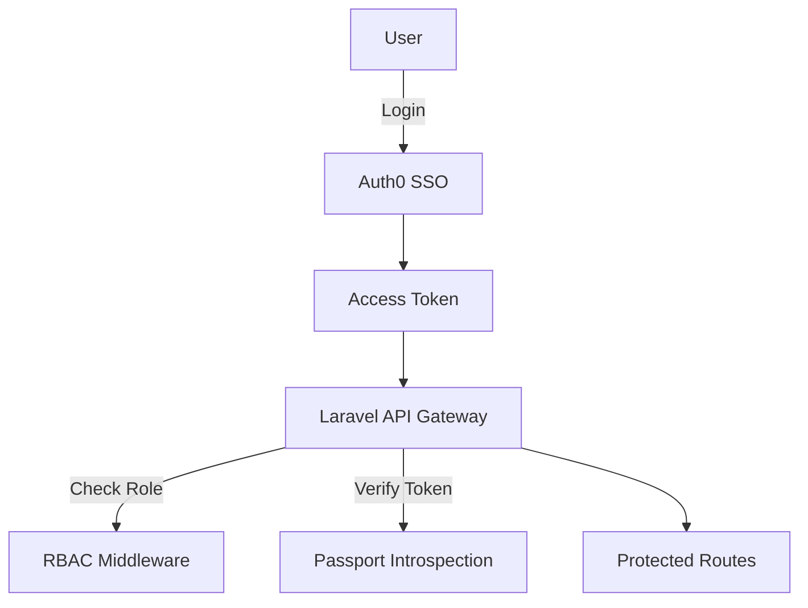

# 🔐 Chapter 3: Authentication & Security Framework

## 🔑 Overview

The authentication and security model for Open Study Volt (OSV) is designed to ensure **safe, scalable access control** and **compliance with global data regulations**. It integrates:
- OAuth2 SSO (via Auth0)
- 2FA for sensitive operations
- Role-Based Access Control (RBAC)
- Secure API token handling
- AI content sanitization & abuse detection
- GDPR and COPPA readiness

---

## 🔐 Authentication Methods

### 1. **SSO via Auth0 (Primary)**
| Feature       | Value                             |
|---------------|------------------------------------|
| Protocol      | OpenID Connect (OIDC)              |
| Providers     | Google, Microsoft, GitHub (configurable) |
| Flows         | Authorization Code + PKCE          |
| Audience      | Public + institutional logins      |

### 2. **Laravel Passport (Fallback)**
Used for internal service communication or custom API integrations (e.g., mobile apps).

### 3. **2FA (Optional per user)**
- TOTP via Authenticator App
- Configurable enforcement by role

---

## 🔐 Role-Based Access Control (RBAC)

Roles are managed in Auth0 and enforced via Laravel middleware.

| Role          | Permissions Summary |
|---------------|---------------------|
| `admin`       | Full access to platform + moderation tools |
| `teacher`     | Manage groups, assign content, access analytics |
| `student`     | Access content, rooms, quizzes |
| `guest`       | Read-only content previews |

RBAC is enforced at:
- Route level (Laravel Policies)
- UI level (React Guards + Feature Flags)
- DB queries (scope-limited access)

---

## 📜 Session & Token Management

| Mechanism           | Purpose                         |
|---------------------|----------------------------------|
| Refresh Tokens      | Re-authentication without logout |
| Access Tokens       | JWTs, signed by Auth0            |
| Cookie Sessions     | Used for browser auth            |
| Expiry Rules        | 15m access / 7d refresh (default) |

---

## 🛡️ AI Query Security

To prevent AI misuse, all prompts and results go through sanitization layers.

| Filter                 | Purpose |
|------------------------|---------|
| Prompt Injection Filter | Detects manipulative instructions |
| Offensive Content Check | Detects toxic/harmful input or output |
| Token Budget Limit     | Prevents prompt flooding or spam abuse |

Abuse patterns trigger alerts via PostHog and Slack integration.

---

## 🧾 Audit & Logging

| Type            | Fields Logged |
|------------------|----------------|
| Auth Events      | login, logout, token refresh, failed auth |
| Content Actions  | uploads, AI queries, quiz attempts |
| Moderator Actions| flags, bans, message deletions |

Logs are stored in:
- JSON log files (via Laravel Log)
- Sentry (errors)
- Logtail (searchable logs)

---

## 🧠 Security Architecture Diagram

---

## 📜 GDPR & COPPA Compliance

| Regulation | Measures in Place |
|------------|-------------------|
| GDPR       | Right to access, export, delete data; encrypted at rest; DPA-compliant providers |
| COPPA      | No data collected for users <13 without verified consent; flag-based parental control |

---

## 🔒 Other Security Features

- HTTPS enforced across all layers
- CORS & CSP headers configured
- Rate limiting (Laravel Throttle)
- Brute force login detection (Auth0 Logs)
- Uploaded files scanned for malware
- Token replay protection

---

## 🔍 Penetration Testing Strategy

- Monthly OWASP scan (automated)
- Manual pentest before major releases
- Session hijack simulation
- Prompt injection fuzzing tests

---

## 📝 Compliance Validator Notes

> “The AI layer is the biggest risk. We need to monitor prompt logs in near-real-time and provide a panic shutdown for suspicious behavior. Auth0 should log all SSO tokens that last longer than 1h.”

---

## 🔗 Dependencies

- Auth0
- Laravel Passport
- Laravel Sanctum (optional API-only flows)
- PostHog (for abuse detection)
- Sentry + Logtail (logging & monitoring)
